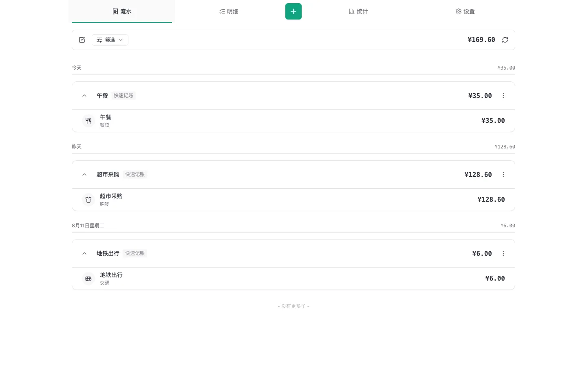

# Cashier

> 把小票、发票和一句话，变成可核对的个人账本。

[English](./README.en.md)

[](https://github.com/Xiangyu-Labs/Cashier/actions/workflows/ci-cd.yml)
[](./LICENSE)



Cashier 最初只是我给自己做的记账工具：拍下小票，或者随手写一句“午饭 35
元”，剩下的整理工作交给 AI。现在它开始作为一个自托管项目开放，希望也能帮到那些
不想每天填写复杂表单、但仍然希望账目可控、可查的人。

Cashier 会从图片或文字中提取日期、商家、金额、币种、分类和消费明细。AI 的结果不会
变成不可触碰的黑盒：你可以在入账前后检查、修改、重试，并在流水、明细和统计中继续
管理这些记录。

## 它能做什么

- 上传小票、发票图片，或直接输入自然语言记账
- 提取账单标题、日期、金额、币种、分类和明细
- 复核和编辑 AI 结果，处理异常与疑似重复账单
- 管理多币种消费，并按账本主币种查看汇总
- 从流水、筛选明细和统计图表回看支出
- 创建账本级 API 密钥，供脚本、快捷指令和外部集成使用
- 使用中文或英文界面

<picture>
  <source media="(max-width: 600px)" srcset="./public/readme/entry-mobile.webp">
  
</picture>

## 快速开始

你只需要 Docker 和 Docker Compose。

```bash
git clone https://github.com/Xiangyu-Labs/Cashier.git
cd Cashier
cp .env.local.example .env
```

编辑 `.env`，至少填写以下三项：

```dotenv
INITIAL_USER_EMAIL=you@example.com
INITIAL_USER_PASSWORD=choose-a-strong-password
OPENAI_API_KEY=your-api-key
```

然后启动：

```bash
docker compose -f docker-compose.yml -f docker-compose.local.yml up -d
```

首次启动会自动创建 PostgreSQL、MinIO 存储桶、数据库表和初始用户。打开
[http://localhost:3000](http://localhost:3000)，使用刚才填写的邮箱和密码登录。

`AI_MODEL` 默认为 `gpt-4o`。如果你使用其他 OpenAI 兼容服务，请同时修改
`OPENAI_BASE_URL` 和 `AI_MODEL`。

需要接入已有的 PostgreSQL、Cloudflare R2 或其他 S3 兼容存储时，请阅读
[部署、升级与备份](./docs/deployment.md)。

## 使用前请知道

> **项目状态：早期公开版本**

- 这个项目源于个人使用，目前开放给其他人试用和反馈，还没有正式稳定版或兼容性承诺。
- AI 可能误读票据或错误分类，重要账目请在入账后人工复核。
- 升级前请备份 PostgreSQL 数据库和对象存储；不要把客户端启动预览当作数据备份。
- AI 解析需要联网，并依赖可用的 OpenAI 或 OpenAI 兼容接口。
- Cashier 是记账工具，不提供会计、税务或财务建议。

## 文档

- [部署、升级与备份](./docs/deployment.md)
- [配置参考](./docs/configuration.md)
- [API v1](./docs/api.md)
- [参与开发](./CONTRIBUTING.md)
- [运行时架构](./docs/architecture/runtime-model.md)
- [架构与编码约定](./docs/architecture/coding-patterns.md)

## 本地开发

本地开发需要 Node.js 24、PostgreSQL 和 S3 兼容存储：

```bash
npm ci
docker compose -f docker-compose.yml -f docker-compose.local.yml up -d \
  postgres minio storage-bootstrap
npm run db:migrate
npm run dev
```

提交改动前运行：

```bash
npm run check
```

更完整的开发约定见 [CONTRIBUTING.md](./CONTRIBUTING.md)。

## License

Cashier 使用 [GNU Affero General Public License v3.0](./LICENSE)。
