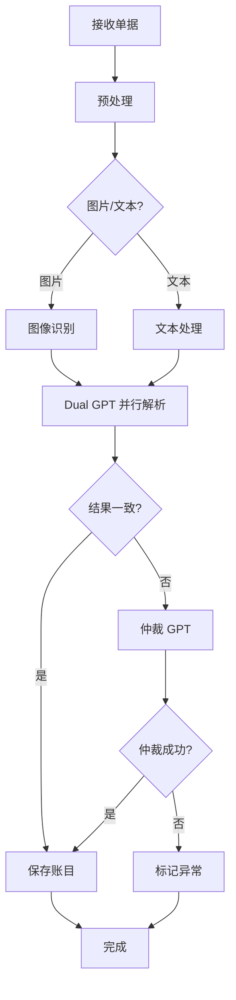
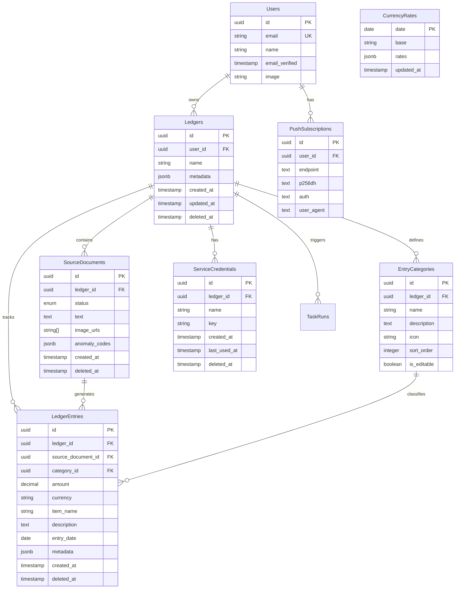

# Cashier 产品需求文档 (PRD)

> **版本**: 1.0.0
> **最后更新**: 2025-01-01
> **状态**: 草案

---

## 目录

1. [产品概述](#第一部分产品概述)
2. [用户与场景](#第二部分用户与场景)
3. [功能规格](#第三部分功能规格)
4. [数据模型](#第四部分数据模型)
5. [界面与交互设计](#第五部分界面与交互设计)
6. [技术规格](#第六部分技术规格)
7. [非功能性需求](#第七部分非功能性需求)
8. [发布与运营](#第八部分发布与运营)
9. [附录](#第九部分附录)

---

## 第一部分：产品概述

### 1.1 产品愿景与定位

**Cashier** 是一款 AI 驱动的智能记账应用，利用大语言模型 (LLM) 自动解析收据、发票和消费凭证，实现费用的智能分类与自动记录。

**核心定位**：
- 🎯 **智能化**：通过 AI 自动识别消费信息，减少手动输入
- 🎯 **轻量化**：专注于个人/小微企业的日常记账需求
- 🎯 **准确性**：采用 Dual GPT 验证 + 仲裁机制，确保数据准确

### 1.2 目标用户画像

| 用户类型 | 特征描述 | 核心需求 |
|---------|---------|---------|
| **个人用户** | 希望追踪个人消费、管理生活支出 | 快速记录、简单分类、月度统计 |
| **小微企业主** | 需要管理店铺/公司的日常收支 | 多账本、发票管理、支出分析 |
| **自由职业者** | 需要追踪项目收入与业务支出 | 多币种支持、分类自定义、报表导出 |
| **出差人员** | 频繁产生差旅费用需要报销 | 拍照记录、多币种、快速归档 |

### 1.3 核心价值主张

1. **拍照即记账**：上传收据照片，AI 自动提取商家、金额、日期、商品明细
2. **智能分类**：基于历史数据和语义理解，自动推荐消费分类
3. **多账本管理**：支持创建多个独立账本，区分个人/家庭/业务
4. **多币种支持**：自动识别货币类型，支持汇率换算
5. **异常检测**：双重 AI 验证机制，识别并标记可疑数据

### 1.4 成功指标 (KPIs)

| 指标 | 目标值 | 测量方式 |
|------|-------|---------|
| **月活用户 (MAU)** | - | Analytics 统计 |
| **AI 解析准确率** | ≥ 95% | 用户修正率反推 |
| **首次解析成功率** | ≥ 90% | 非 anomaly 状态占比 |
| **平均解析时间** | < 10s | 任务执行时间监控 |
| **用户留存率 (D7)** | ≥ 40% | Cohort 分析 |

### 1.5 版本规划路线图

```
v1.0 (MVP)
├── Magic Link 登录
├── 账本 CRUD
├── 图片/文本上传
├── AI 解析 (Dual GPT)
├── 账目列表与详情
└── 基础统计

v1.1
├── 自定义分类
├── 多币种汇率
├── Web Push 通知
└── 批量上传

v1.2
├── 报表导出 (CSV/PDF)
├── 周期性统计
├── 预算管理
└── 数据备份

v2.0
├── 团队协作
├── 发票 OCR 增强
├── 银行账单导入
└── API 开放平台
```

---

## 第二部分：用户与场景

### 2.1 用户角色定义

| 角色 | 权限 | 说明 |
|------|-----|------|
| **账本所有者** | 完全控制 | 创建账本的用户，拥有账本的所有权限 |
| **API 调用者** | 仅上传 | 通过 Service Credential 上传单据 |

### 2.2 用户故事 (User Stories)

#### 认证与账户管理

| ID | 用户故事 | 验收标准 |
|----|---------|---------|
| **US-001** | 作为新用户，我希望通过邮箱注册，以便快速开始使用 | 输入邮箱后收到 Magic Link，点击后完成登录 |
| **US-002** | 作为用户，我希望通过 Magic Link 登录，以便无需记忆密码 | 点击邮件链接后自动登录，链接 5 分钟有效 |
| **US-003** | 作为用户，我希望登出当前设备，以确保账户安全 | 点击登出后清除会话，跳转登录页 |
| **US-004** | 作为用户，我希望查看所有登录设备，以便管理会话安全 | 显示设备列表，支持单独撤销 |

#### 账本管理

| ID | 用户故事 | 验收标准 |
|----|---------|---------|
| **US-010** | 作为用户，我希望创建新账本，以便分类管理不同场景的账目 | 输入名称后创建成功，自动跳转账本详情 |
| **US-011** | 作为用户，我希望编辑账本名称和设置，以便调整账本配置 | 修改后立即生效，显示成功提示 |
| **US-012** | 作为用户，我希望删除账本，以便清理不再使用的数据 | 二次确认后软删除，数据可恢复 |
| **US-013** | 作为用户，我希望设置账本的默认货币，以便统计时统一换算 | 在账本设置中选择货币，影响统计展示 |
| **US-014** | 作为用户，我希望自定义 AI 处理语言，以便获得本地化的解析结果 | 设置后新上传的单据使用该语言解析 |

#### 单据上传与 AI 解析

| ID | 用户故事 | 验收标准 |
|----|---------|---------|
| **US-020** | 作为用户，我希望上传收据照片，以便 AI 自动识别消费信息 | 上传后显示处理中状态，完成后生成账目 |
| **US-021** | 作为用户，我希望直接输入文本描述，以便快速记录无凭证的消费 | 输入文本后 AI 解析生成结构化账目 |
| **US-022** | 作为用户，我希望查看解析进度，以便了解处理状态 | 实时显示 queued/processing/completed 状态 |
| **US-023** | 作为用户，我希望处理失败时看到明确的错误原因，以便知道如何修正 | 显示人性化的错误描述，提供重试选项 |
| **US-024** | 作为用户，我希望重新处理异常单据，以便修复解析问题 | 点击重试后重新进入处理队列 |
| **US-025** | 作为用户，我希望删除无法识别的单据，以便保持数据整洁 | 删除后单据及关联账目一并移除 |

#### 账目管理

| ID | 用户故事 | 验收标准 |
|----|---------|---------|
| **US-030** | 作为用户，我希望查看所有账目列表，以便浏览消费记录 | 按日期分组显示，支持无限滚动 |
| **US-031** | 作为用户，我希望查看账目详情，以便核对具体信息 | 显示商家、金额、日期、分类、原始凭证 |
| **US-032** | 作为用户，我希望编辑账目信息，以便修正 AI 解析错误 | 支持修改所有字段，保存后立即生效 |
| **US-033** | 作为用户，我希望删除错误账目，以便移除无效数据 | 二次确认后软删除 |
| **US-034** | 作为用户，我希望为账目指定分类，以便后续统计分析 | 从分类列表中选择或创建新分类 |

#### 统计与分析

| ID | 用户故事 | 验收标准 |
|----|---------|---------|
| **US-040** | 作为用户，我希望查看月度支出汇总，以便了解整体消费情况 | 显示当月总支出、笔数、日均消费 |
| **US-041** | 作为用户，我希望查看分类支出排行，以便发现主要支出类别 | 按金额降序排列，显示占比 |
| **US-042** | 作为用户，我希望查看支出趋势图表，以便观察消费变化 | 显示近 6 个月的月度对比柱状图 |
| **US-043** | 作为用户，我希望切换统计的货币单位，以便按偏好查看 | 自动按当日汇率换算显示 |

### 2.3 使用场景

#### 场景一：餐厅消费记账

```
用户小明在餐厅用餐后，掏出手机拍摄收据照片。

1. 打开 Cashier App，进入"日常消费"账本
2. 点击上传按钮，选择拍照
3. 拍摄收据，确认上传
4. 等待 3-5 秒，看到处理完成
5. 系统自动生成账目：
   - 商家：某某餐厅
   - 金额：¥128.00
   - 日期：2025-01-15
   - 分类：餐饮（自动推荐）
6. 小明确认无误，账目保存成功
```

#### 场景二：出差多币种报销

```
用户小李出差日本，产生多笔日元消费。

1. 在东京便利店购物，获得日元收据
2. 拍照上传至"出差报销"账本
3. AI 自动识别：
   - 金额：¥2,480（日元）
   - 自动标注货币类型
4. 回国后查看账本统计
5. 系统按当日汇率换算为人民币显示
6. 导出报销清单
```

#### 场景三：分类自定义

```
自由职业者小王需要区分业务支出和个人消费。

1. 进入账本设置
2. 创建自定义分类："设备采购"、"软件订阅"、"交通差旅"
3. 上传新单据时，AI 根据内容推荐分类
4. 小王可手动调整或确认推荐
5. 月底查看分类统计，清晰了解业务成本结构
```

---

## 第三部分：功能规格

### 3.1 功能模块总览

```
┌─────────────────────────────────────────────────────────────┐
│                        Cashier                               │
├─────────────┬─────────────┬─────────────┬───────────────────┤
│   F-AUTH    │  F-LEDGER   │   F-DOC     │      F-AI         │
│  认证模块   │  账本模块   │  单据模块   │    AI 处理        │
├─────────────┼─────────────┼─────────────┼───────────────────┤
│  F-ENTRY    │ F-CURRENCY  │  F-STATS    │   F-NOTIFY        │
│  账目模块   │  币种模块   │  统计模块   │   通知模块        │
└─────────────┴─────────────┴─────────────┴───────────────────┘
```

### 3.2 F-AUTH：认证模块

#### 功能描述

提供基于 Magic Link 的无密码认证体验。

#### 功能规格

| 功能 | 描述 | 优先级 |
|------|-----|-------|
| **Magic Link 登录** | 用户输入邮箱，系统发送包含登录链接的邮件 | P0 |
| **链接验证** | 验证链接有效性（5 分钟过期、单次使用） | P0 |
| **会话管理** | 创建持久会话，支持"记住我" | P0 |
| **登出** | 清除当前设备会话 | P0 |
| **设备管理** | 查看已登录设备，支持远程登出 | P1 |

#### 业务规则

- Magic Link 有效期：5 分钟
- 同一邮箱 60 秒内只能请求一次 Magic Link
- 会话默认有效期：30 天
- 单个账户最多同时登录 5 个设备

#### 技术实现

- 使用 Auth.js (NextAuth) v5
- 邮件发送服务：Resend
- 会话存储：数据库 (SQLite)

### 3.3 F-LEDGER：账本模块

#### 功能描述

账本是数据隔离的基本单元，所有财务数据都归属于特定账本。

#### 功能规格

| 功能 | 描述 | 优先级 |
|------|-----|-------|
| **创建账本** | 创建新账本，设置名称 | P0 |
| **账本列表** | 查看用户所有账本 | P0 |
| **账本详情** | 查看账本的统计概览 | P0 |
| **编辑账本** | 修改账本名称和设置 | P0 |
| **删除账本** | 软删除账本及其所有数据 | P0 |
| **账本设置** | 配置默认货币、AI 语言、自定义提示词 | P1 |
| **分类管理** | 管理账本的支出分类 | P1 |
| **服务凭证** | 生成 API Key 用于外部集成 | P2 |

#### 账本设置项

| 设置项 | 类型 | 默认值 | 说明 |
|--------|-----|-------|------|
| `mainCurrency` | string | "CNY" | 主货币，用于统计换算 |
| `aiLanguage` | string | "zh" | AI 响应语言 |
| `autoRecognizeDate` | boolean | true | 是否自动识别日期 |
| `aiCustomPrompt` | string | "" | 自定义 AI 处理指令 |

#### 分类管理

系统预置默认分类：

| 分类名称 | 图标 | 可编辑 |
|---------|-----|-------|
| 餐饮 | 🍽️ | 否 |
| 交通 | 🚗 | 否 |
| 购物 | 🛒 | 否 |
| 娱乐 | 🎮 | 否 |
| 其他 | 📦 | 否 |

用户可创建自定义分类，支持：
- 自定义名称
- 选择图标
- 调整排序
- 编辑/删除

### 3.4 F-DOC：单据模块

#### 功能描述

管理用户上传的原始凭证（图片或文本），作为 AI 解析的输入。

#### 功能规格

| 功能 | 描述 | 优先级 |
|------|-----|-------|
| **图片上传** | 上传收据/发票照片 | P0 |
| **文本输入** | 直接输入消费描述文本 | P0 |
| **状态查询** | 查看单据处理状态 | P0 |
| **重试处理** | 重新触发异常单据的 AI 解析 | P0 |
| **删除单据** | 删除单据及关联账目 | P0 |
| **批量上传** | 一次上传多张图片 | P1 |

#### 单据状态机

```
                    ┌──────────────────────────────────────┐
                    │                                      │
                    ▼                                      │
┌─────────┐    ┌────────────┐    ┌───────────┐    ┌───────────┐
│ queued  │───▶│ processing │───▶│ completed │    │  anomaly  │
└─────────┘    └────────────┘    └───────────┘    └───────────┘
                    │                                      ▲
                    │                                      │
                    └──────────────────────────────────────┘
                              (解析失败/异常)
```

| 状态 | 说明 | 用户可见 |
|-----|------|---------|
| `queued` | 等待处理 | "排队中" |
| `processing` | 正在解析 | "处理中" |
| `completed` | 解析成功 | "已完成" |
| `anomaly` | 解析异常 | "处理异常" + 具体原因 |

#### 异常代码 (Anomaly Codes)

| 代码 | 说明 | 用户提示 |
|-----|------|---------|
| `internal_error` | 系统内部错误 | "系统繁忙，请稍后重试" |
| `invalid_content` | 内容无法识别 | "未识别到有效的消费信息" |
| `evidence_anomaly` | 凭证数据异常 | "凭证信息不完整" |

### 3.5 F-AI：AI 处理模块

#### 功能描述

核心 AI 解析引擎，采用 Dual GPT + 仲裁机制确保准确性。

#### 处理流程



#### Dual GPT 验证机制

1. **并行执行**：将相同的输入发送给 LLM 两次
2. **结果对比**：
   - 比较账目数量
   - 比较各币种总金额
   - 比较关键字段（商家、日期）
3. **一致性判定**：
   - 完全一致 → 直接采用
   - 存在差异 → 触发仲裁

#### 仲裁机制

当两次解析结果不一致时：

1. 将原始输入 + 两个结果发送给仲裁 GPT
2. 仲裁 GPT 分析差异，选择正确结果或判定无法确定
3. 仲裁成功 → 采用选定结果
4. 仲裁失败 → 标记为 `anomaly`

#### 解析输出格式

```typescript
interface ParsedEntry {
  itemName: string;        // 商品/服务名称
  amount: number;          // 金额
  currency: string;        // 货币代码 (ISO 4217)
  entryDate: string;       // 消费日期 (YYYY-MM-DD)
  description?: string;    // 补充描述
  suggestedCategory?: string; // 推荐分类
}
```

### 3.6 F-ENTRY：账目模块

#### 功能描述

管理结构化的账目记录，是用户交互的核心数据。

#### 功能规格

| 功能 | 描述 | 优先级 |
|------|-----|-------|
| **账目列表** | 按日期分组展示账目 | P0 |
| **账目详情** | 查看完整账目信息 | P0 |
| **编辑账目** | 修改账目字段 | P0 |
| **删除账目** | 软删除账目 | P0 |
| **分类指派** | 为账目设置分类 | P1 |
| **搜索过滤** | 按关键词、日期、分类筛选 | P2 |

#### 账目字段

| 字段 | 类型 | 必填 | 说明 |
|-----|------|-----|------|
| `itemName` | string | 是 | 商品/服务名称 |
| `amount` | decimal | 是 | 金额（正数） |
| `currency` | string | 是 | 货币代码 |
| `entryDate` | date | 是 | 消费日期 |
| `description` | text | 否 | 补充描述 |
| `categoryId` | uuid | 否 | 关联分类 |
| `sourceDocumentId` | uuid | 否 | 关联原始单据 |

### 3.7 F-CURRENCY：币种模块

#### 功能描述

支持多币种记录和汇率换算。

#### 支持币种

| 代码 | 名称 | 符号 |
|-----|------|-----|
| CNY | 人民币 | ¥ |
| USD | 美元 | $ |
| EUR | 欧元 | € |
| JPY | 日元 | ¥ |
| GBP | 英镑 | £ |
| HKD | 港币 | HK$ |
| TWD | 新台币 | NT$ |
| KRW | 韩元 | ₩ |

#### 汇率获取

- 数据源：外部汇率 API
- 更新频率：每日一次
- 缓存策略：存储于 `currency_rates` 表

### 3.8 F-STATS：统计模块

#### 功能描述

提供账目的汇总分析和可视化。

#### 功能规格

| 功能 | 描述 | 优先级 |
|------|-----|-------|
| **月度汇总** | 当月总支出、笔数、日均 | P0 |
| **分类排行** | 按分类统计支出占比 | P1 |
| **趋势图表** | 近 N 月支出趋势 | P1 |
| **货币换算** | 按主货币统一显示 | P1 |

#### 统计指标

| 指标 | 计算方式 |
|-----|---------|
| 月度总支出 | SUM(amount) WHERE month = current |
| 月度笔数 | COUNT(*) WHERE month = current |
| 日均支出 | 月度总支出 / 已过天数 |
| 分类占比 | 分类支出 / 总支出 × 100% |

### 3.9 F-NOTIFY：通知模块

#### 功能描述

通过 Web Push 向用户推送处理结果通知。

#### 功能规格

| 功能 | 描述 | 优先级 |
|------|-----|-------|
| **订阅管理** | 订阅/取消 Web Push | P2 |
| **处理完成通知** | 单据处理完成时推送 | P2 |
| **异常告警** | 处理异常时推送 | P2 |

---

## 第四部分：数据模型

### 4.1 实体关系图 (ERD)



### 4.2 核心实体定义

#### Users（用户）

用户账户信息，由 Auth.js 管理。

| 字段 | 类型 | 约束 | 说明 |
|-----|------|-----|------|
| id | uuid | PK | 用户唯一标识 |
| email | string | UK, NOT NULL | 登录邮箱 |
| name | string | | 显示名称 |
| email_verified | timestamp | | 邮箱验证时间 |
| image | string | | 头像 URL |

#### Ledgers（账本）

账本是多租户隔离的根实体。

| 字段 | 类型 | 约束 | 说明 |
|-----|------|-----|------|
| id | uuid | PK | 账本唯一标识 |
| user_id | uuid | FK → Users | 所属用户 |
| name | string | NOT NULL | 账本名称 |
| metadata | jsonb | | 账本设置（见 3.3） |
| created_at | timestamp | NOT NULL | 创建时间 |
| updated_at | timestamp | NOT NULL | 更新时间 |
| deleted_at | timestamp | | 软删除时间 |

#### SourceDocuments（原始单据）

用户上传的原始凭证。

| 字段 | 类型 | 约束 | 说明 |
|-----|------|-----|------|
| id | uuid | PK | 单据唯一标识 |
| ledger_id | uuid | FK → Ledgers | 所属账本 |
| status | enum | NOT NULL | 处理状态 |
| text | text | | 文本内容 |
| image_urls | string[] | | 图片 URL 列表 |
| anomaly_codes | jsonb | | 异常代码数组 |
| created_at | timestamp | NOT NULL | 创建时间 |
| deleted_at | timestamp | | 软删除时间 |

#### LedgerEntries（账目）

结构化的账目记录。

| 字段 | 类型 | 约束 | 说明 |
|-----|------|-----|------|
| id | uuid | PK | 账目唯一标识 |
| ledger_id | uuid | FK → Ledgers | 所属账本 |
| source_document_id | uuid | FK → SourceDocuments | 来源单据 |
| category_id | uuid | FK → EntryCategories | 分类 |
| amount | decimal(12,2) | NOT NULL | 金额 |
| currency | string(3) | NOT NULL | 货币代码 |
| item_name | string | NOT NULL | 项目名称 |
| description | text | | 描述 |
| entry_date | date | NOT NULL | 消费日期 |
| metadata | jsonb | | 扩展元数据 |
| created_at | timestamp | NOT NULL | 创建时间 |
| deleted_at | timestamp | | 软删除时间 |

#### EntryCategories（分类）

账目分类定义。

| 字段 | 类型 | 约束 | 说明 |
|-----|------|-----|------|
| id | uuid | PK | 分类唯一标识 |
| ledger_id | uuid | FK → Ledgers | 所属账本 |
| name | string | NOT NULL | 分类名称 |
| description | text | | 分类描述 |
| icon | string | | 图标标识 |
| sort_order | integer | | 排序权重 |
| is_editable | boolean | DEFAULT true | 是否可编辑 |

### 4.3 数据完整性规则

#### 软删除策略

- 所有业务实体使用软删除（`deleted_at` 字段）
- 查询时默认过滤已删除记录
- 提供恢复机制（管理员功能）

#### 级联删除

| 操作 | 影响 |
|-----|------|
| 删除账本 | 级联软删除：单据、账目、分类、凭证 |
| 删除单据 | 级联软删除：关联账目 |
| 删除分类 | 账目的 category_id 置为 NULL |

#### 租户隔离

- 所有数据查询必须经过 Scoped Query 过滤
- 确保用户只能访问自己账本的数据
- API 层面验证账本所有权

### 4.4 详细文档引用

完整的数据模型定义请参考：[数据库 Schema 文档](./database_schema.md)

---

## 第五部分：界面与交互设计

### 5.1 信息架构

```
/
├── /login                    # 登录页
├── /[locale]/                # 本地化路由前缀
│   ├── /                     # 首页（重定向到账本列表）
│   ├── /ledgers              # 账本列表
│   │   └── /[ledgerId]       # 账本详情
│   │       ├── /entries      # 账目标签页
│   │       ├── /documents    # 单据标签页
│   │       └── /settings     # 设置标签页
│   └── /settings             # 用户设置
└── /api/                     # API 路由
```

### 5.2 核心页面规格

#### 登录页 (/login)

**目的**：用户认证入口

**布局**：
- 居中卡片式布局
- 品牌 Logo
- 邮箱输入框
- 发送 Magic Link 按钮
- 提示文案

**交互**：
1. 输入邮箱 → 验证格式
2. 点击发送 → 显示加载状态
3. 发送成功 → 显示确认消息
4. 发送失败 → 显示错误提示

#### 账本列表页 (/ledgers)

**目的**：展示用户所有账本，提供快速入口

**布局**：
- 页面标题 + 新建按钮
- 账本卡片网格（2 列）
- 每张卡片显示：名称、统计摘要、最后更新时间

**交互**：
- 点击卡片 → 进入账本详情
- 点击新建 → 打开新建账本 Dialog
- 长按/右键 → 显示操作菜单（编辑、删除）

#### 账本详情页 (/ledgers/[ledgerId])

**目的**：账本的主工作区

**布局**：
- 顶部：账本名称 + 操作按钮
- 统计卡片区：月度支出、笔数、分类分布
- 标签页导航：账目 | 单据 | 设置
- 浮动上传按钮（移动端）

**标签页内容**：

| 标签页 | 内容 |
|-------|-----|
| 账目 | 按日期分组的账目列表，每日小计 |
| 单据 | 单据卡片列表，显示状态和缩略图 |
| 设置 | 账本配置项 + 分类管理 |

#### 单据上传交互

**上传方式**：
1. 点击上传按钮 → 选择图片/文本
2. 拍照上传（移动端相机）
3. 拖放图片到上传区域（桌面端）

**上传流程**：
1. 选择文件 → 显示预览
2. 确认上传 → 显示进度
3. 上传完成 → 进入处理队列
4. 处理完成 → Toast 通知 + 列表刷新

#### 账目详情 Modal

**目的**：查看和编辑账目信息

**布局**：
- 标题：项目名称
- 表单字段：金额、货币、日期、分类、描述
- 原始凭证预览（如有）
- 操作按钮：保存、删除

### 5.3 响应式设计断点

| 断点 | 宽度 | 布局调整 |
|-----|------|---------|
| 移动端 | < 768px | 单列布局、底部导航、抽屉式 Modal |
| 桌面端 | ≥ 768px | 多列布局、侧边栏、居中 Modal |

### 5.4 设计规范引用

完整的 UI 设计系统请参考：[UI 设计规范](./UI.md)

核心设计原则：
- 背景层级 ≤ 2
- 只使用一个品牌色
- 边框优先于阴影
- 克制动效（位移 ≤ 2px）

---

## 第六部分：技术规格

### 6.1 技术栈

| 层级 | 技术选型 | 说明 |
|-----|---------|------|
| **框架** | Next.js 16 (App Router) | React 全栈框架 |
| **语言** | TypeScript | 类型安全 |
| **数据库** | SQLite | 嵌入式关系型数据库 |
| **ORM** | Drizzle ORM | 类型安全的 SQL |
| **认证** | Auth.js v5 | 无密码认证 |
| **邮件** | Resend | Magic Link 发送 |
| **AI** | OpenAI GPT-4o | 文档解析 |
| **UI** | Tailwind CSS + Shadcn/ui | 组件库 |
| **状态管理** | Zustand + TanStack Query | 客户端/服务端状态 |
| **国际化** | next-intl | 多语言支持 |
| **部署** | Docker | 容器化部署 |

### 6.2 架构模式

#### Feature-Based Architecture

代码按领域功能组织，而非技术分层：

```
src/features/
├── auth/           # 认证功能
├── ledger/         # 账本功能
├── source-document/# 单据功能
├── ai/             # AI 处理
└── ...
```

每个 Feature 包含：
- `components/` - 功能专属 UI 组件
- `server/` - Server Actions 和业务逻辑
- `client/` - 客户端 Hooks 和状态

#### Server Actions

使用 Next.js Server Actions 替代传统 API Routes：

```typescript
// src/features/ledger/server/actions/create-ledger.ts
"use server";

export async function createLedger(data: CreateLedgerInput) {
  // 直接在服务端执行数据库操作
}
```

#### Scoped Query

租户隔离的数据访问模式：

```typescript
// 确保所有查询都限定在当前账本
const entries = await forLedger(ledgerId)
  .select()
  .from(ledgerEntries)
  .where(isNull(ledgerEntries.deletedAt));
```

### 6.3 API 设计

#### 内部 API (Server Actions)

| 模块 | Action | 说明 |
|-----|--------|------|
| Ledger | `createLedger` | 创建账本 |
| Ledger | `updateLedger` | 更新账本 |
| Ledger | `deleteLedger` | 删除账本 |
| SourceDocument | `uploadDocument` | 上传单据 |
| SourceDocument | `retryDocument` | 重试处理 |
| LedgerEntry | `updateEntry` | 更新账目 |
| LedgerEntry | `deleteEntry` | 删除账目 |

#### 外部 API

通过 Service Credentials 认证的 REST API：

```
POST /api/v1/ledgers/{ledgerId}/documents
Authorization: Bearer sk_live_xxxxx
Content-Type: multipart/form-data
```

### 6.4 安全要求

| 类别 | 要求 |
|-----|------|
| **认证** | 所有页面（登录页除外）需要认证 |
| **授权** | 验证资源所有权（账本归属） |
| **输入验证** | Zod Schema 验证所有输入 |
| **XSS 防护** | React 自动转义 + CSP |
| **CSRF 防护** | Server Actions 内置保护 |
| **敏感数据** | 服务凭证加密存储 |

### 6.5 性能指标

| 指标 | 目标 | 测量方式 |
|-----|------|---------|
| **首屏加载 (LCP)** | < 2.5s | Lighthouse |
| **交互响应 (FID)** | < 100ms | Lighthouse |
| **页面切换** | < 300ms | 客户端测量 |
| **AI 解析** | < 10s | 任务执行时间 |

---

## 第七部分：非功能性需求

### 7.1 可用性

- **目标可用性**：99.9%（每月宕机 < 43 分钟）
- **错误处理**：所有错误显示用户友好的提示
- **离线支持**：暂不支持（v2.0 考虑）

### 7.2 可扩展性

- **用户量**：支持单实例 1000+ 并发用户
- **数据量**：单账本支持 100,000+ 账目
- **横向扩展**：Docker 容器支持多实例部署

### 7.3 可维护性

- **代码规范**：ESLint + Prettier
- **类型安全**：TypeScript strict mode
- **测试覆盖**：核心功能 80%+ 覆盖率
- **文档**：API 和数据模型完整文档化

### 7.4 国际化

| 语言 | 代码 | 状态 |
|-----|-----|------|
| 简体中文 | zh | 完整支持 |
| English | en | 完整支持 |

实现要求：
- 所有用户可见文本使用 next-intl
- 日期/货币格式化使用 Intl API
- 禁止硬编码文本字符串

### 7.5 可访问性

遵循 WCAG 2.1 AA 标准：

- 键盘完全可操作
- 焦点可见且合理
- 色彩对比度 ≥ 4.5:1
- 图片提供 alt 文本
- 表单标签正确关联
- 支持 `prefers-reduced-motion`

---

## 第八部分：发布与运营

### 8.1 发布检查清单

#### 功能验证

- [ ] 所有核心用户故事可完成
- [ ] 多浏览器测试（Chrome、Safari、Firefox）
- [ ] 移动端响应式测试
- [ ] AI 解析准确率达标

#### 安全验证

- [ ] 认证流程安全
- [ ] 权限控制正确
- [ ] 敏感数据加密
- [ ] 无已知安全漏洞

#### 性能验证

- [ ] Lighthouse 评分 ≥ 90
- [ ] 首屏加载 < 2.5s
- [ ] 无内存泄漏

### 8.2 监控指标

| 类别 | 指标 | 告警阈值 |
|-----|------|---------|
| **可用性** | 服务健康检查 | 连续失败 3 次 |
| **错误率** | 5xx 错误率 | > 1% |
| **延迟** | P99 响应时间 | > 3s |
| **AI** | 解析失败率 | > 10% |

### 8.3 用户反馈渠道

- 应用内反馈表单
- GitHub Issues
- 邮件支持

---

## 第九部分：附录

### 9.1 术语表

| 术语 | 定义 |
|-----|------|
| **账本 (Ledger)** | 数据隔离的顶层容器，用户可创建多个账本 |
| **单据 (Source Document)** | 用户上传的原始凭证（图片或文本） |
| **账目 (Ledger Entry)** | 结构化的财务记录 |
| **分类 (Category)** | 账目的分类标签 |
| **服务凭证 (Service Credential)** | 用于 API 访问的密钥 |
| **异常状态 (Anomaly)** | 单据处理失败或需要人工确认的状态 |
| **Magic Link** | 无密码登录链接 |
| **Dual GPT** | 双重 AI 验证机制 |

### 9.2 相关文档

| 文档 | 说明 |
|-----|------|
| [架构概览](./architecture_overview.md) | 系统整体架构设计 |
| [数据库 Schema](./database_schema.md) | 完整数据模型定义 |
| [AI 处理流程](./ai_pipeline_architecture.md) | AI 解析详细流程 |
| [UI 设计规范](./UI.md) | 界面设计系统 |
| [错误码指南](./error_code_guide.md) | 异常代码扩展指南 |

### 9.3 变更日志

| 版本 | 日期 | 变更内容 |
|-----|------|---------|
| 1.0.0 | 2025-01-01 | 初始版本 |

---

> **文档所有者**：产品团队
> **技术审核**：技术团队
> **最后审核日期**：2025-01-01
