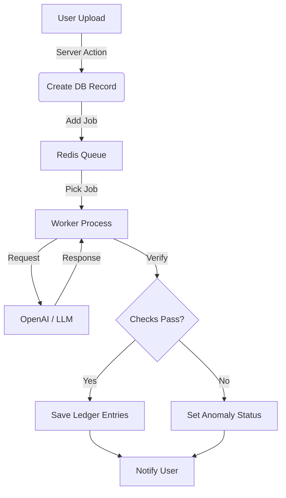

# AI Pipeline Architecture

Cashier uses an asynchronous, message-queue-based architecture to process receipts and invoices. This ensures that long-running AI tasks do not block the user interface and provides robustness against failures.

## 1. High-Level Flow Overview

1.  **User Action**: User uploads a file/text via the UI.
2.  **API Layer**: Server Action creates a `scanned_documents` record with status `processing` and adds a job to the **Redis Queue** (BullMQ).
3.  **Worker Process**: A separate Node.js process picks up the job.
4.  **AI Processing**: The worker calls OpenAI (or other LLMs) to parse the document.
5.  **Verification & Arbitration**: The system runs checks (Dual GPT) and arbitrates if results conflict.
6.  **Result Persistence**: Valid results are saved to `ledger_entries`; the document status is updated to `completed`.
7.  **Notification**: The user receives a Push Notification or UI update via SSE.



## 2. The Worker Infrastructure

The worker is a standalone Node.js process defined in `src/worker.ts`. It runs independently from the Next.js web server but shares the same code for database access and business logic.

-   **Entry Point**: `src/worker.ts`
-   **Infrastructure**: `src/lib/flow/workers.ts` (manages BullMQ Workers)
-   **Queues**:
    -   `main`: For heavy processing tasks (e.g., parsing documents).
    -   `api`: For rate-limited external API calls (reserved).

## 3. The Parsing Task: "Dual GPT + Arbitration"

The core logic resides in `src/features/source-document/server/tasks/parse-source-document.ts`. We use a sophisticated **"Consensus & Arbitration"** strategy to ensure accuracy.

### Step 3.1: Dual Execution
The system sends the **same prompt** to the LLM **twice in parallel**.
```typescript
const [result1, result2] = await Promise.all([
    processor.process(payload, options),
    processor.process(payload, options)
]);
```

### Step 3.2: Verification
We compare `result1` and `result2` using strict logic (`verifyAmounts`):
-   Do they have the same number of entries?
-   Do the total amounts match (per currency)?
-   **If they match**: We assume the result is correct.
-   **If they differ**: We assume *ambiguity* or *hallucination*.

### Step 3.3: Arbitration (The "Judge")
If `result1 !== result2`, we invoke a third LLM call: the **Arbitrator**.
The Arbitrator is given:
-    The original text/image.
-   The two conflicting outputs (`result1` vs `result2`).
-   An instruction to decide which one is correct, or if *both* are wrong.

This significantly reduces "silent failures" where an LLM confidently outputs wrong numbers.

## 4. Idempotency & Error Handling

-   **Idempotency**: The worker checks if `ledger_entries` already exist for a document ID before saving. If the job runs twice by accident, it won't duplicate data.
-   **Anomalies**: If the document cannot be parsed (e.g., blurred image, unrelated text), it is not "Failed" (which implies a system crash) but set to `anomaly` status. This prompts the user to review it manually.
-   **Retries**: BullMQ handles transient failures (e.g., OpenAI network timeout) with exponential backoff.

## 5. Adding New Tasks

To add a new background task:

1.  Define the Task Handler in `src/features/[feature]/server/tasks/`.
2.  Register it using `registerFlowTask`.
3.  Import the file in `src/worker.ts` to ensure it executes in the worker process.

```typescript
// Example Registration
import { registerFlowTask } from '@/lib/flow';
registerFlowTask("my_new_task", myTaskHandler);
```
