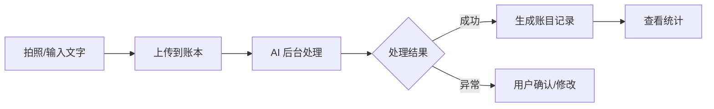
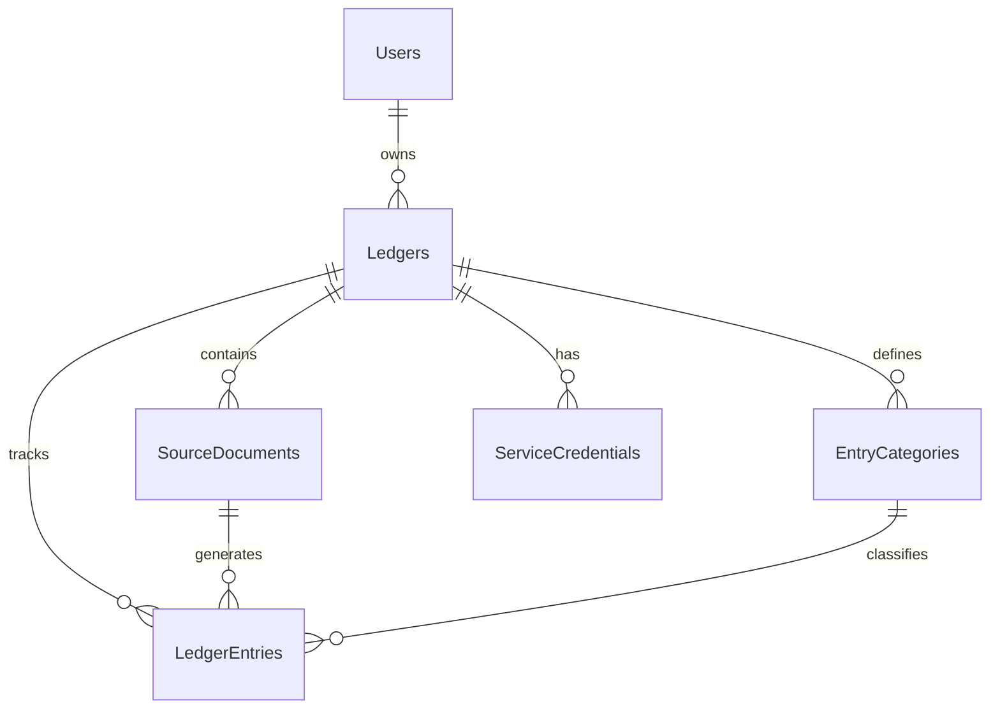
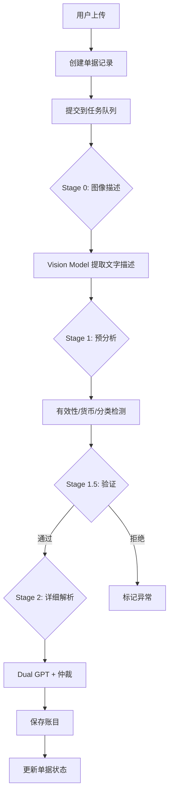

# Cashier 产品需求文档 (PRD)

> **版本**: 2.1.0
> **最后更新**: 2026-03-07
> **状态**: 已发布

---

## 目录

1. [产品概述](#第一部分产品概述)
2. [用户与场景](#第二部分用户与场景)
3. [功能规格](#第三部分功能规格)
4. [数据模型](#第四部分数据模型)
5. [界面设计](#第五部分界面设计)
6. [技术规格](#第六部分技术规格)
7. [附录](#第七部分附录)

---

## 第一部分：产品概述

### 1.1 产品愿景

**Cashier** 是一款面向「懒得记账」用户的 AI 记账工具。通过上传收据照片或简单的文字描述，AI 自动完成消费信息的提取和分类，让记账这件事变得毫不费力。

> [!IMPORTANT]
> **核心理念**：不是专业财务软件的替代品，而是让普通人愿意开始记账的「超低门槛工具」。

### 1.2 目标用户

| 用户类型 | 典型场景 | 核心诉求 |
|---------|---------|---------|
| **日常消费者** | 饭后随手拍个收据 | 不想手动输入，拍照就完事 |
| **出差人员** | 出差期间积累多张发票 | 多币种自动识别，方便归档 |
| **轻度理财者** | 偶尔想看看钱花哪儿了 | 简单的分类统计，不要复杂报表 |

**不是目标用户**：
- 需要复杂财务报表的专业会计
- 需要多人协作的企业用户
- 需要与银行系统对接的高级用户

### 1.3 核心价值

1. **极简上传**：双击手机背板即可截图上传，付完款两秒记完账
2. **拍照即记账**：上传收据照片，AI 自动提取商家、金额、日期、商品明细
3. **文字也能记**：输入「星巴克 38」这样的简单描述，AI 也能理解
4. **快速记账**：无需 AI 解析，直接输入金额和分类即可快速记账
5. **可视化统计**：趋势图 + GitHub-style 日历热力图，支出一目了然
6. **多币种支持**：自动识别货币类型，按汇率换算统计
7. **分类管理**：预置常用分类 + 支持自定义
8. **多账本隔离**：可创建多个账本区分不同场景
9. **开放 API**：支持与快捷指令、自动化工具集成
10. **多种登录方式**：OTP 验证码、OIDC/SSO 单点登录

### 1.4 AI 处理说明

> [!NOTE]
> Cashier 的核心能力依赖 AI 进行文档解析。AI 处理为异步任务，上传后需等待后台完成解析。

- **处理方式**：后台 AI 任务队列异步执行（FlowEngine 任务引擎）
- **模型分层**：Vision Model 负责图像理解，Text Model 负责解析和仲裁
- **处理流程**：Stage 0 (图像描述) → Stage 1 (预分析) → Stage 1.5 (验证) → Stage 2 (详细解析)
- **验证机制**：Dual GPT + 仲裁机制确保准确性
- **异常处理**：无法识别的内容会标记为「异常」供用户确认
- **可靠性**：内置 JSON 自动修复机制处理非标准 AI 输出

---

## 第二部分：用户与场景

### 2.1 核心用户旅程



### 2.2 典型使用场景

#### 场景一：餐厅消费

```
1. 用餐结束，拿出手机拍摄收据
2. 打开 Cashier，选择账本，上传照片
3. 等待几秒，AI 自动生成账目：
   - 商家：某某餐厅
   - 金额：¥128.00
   - 分类：餐饮（自动推荐）
4. 确认无误，完成记账
```

#### 场景二：多币种出差

```
1. 在日本便利店购物，获得日元收据
2. 拍照上传到「出差」账本
3. AI 自动识别金额和货币类型（¥2,480 日元）
4. 查看统计时，自动按汇率换算为主货币显示
```

#### 场景三：双击背板极速记账（iOS 快捷指令）

```
1. 微信/支付宝完成付款，屏幕显示支付成功页面
2. 双击手机背板，自动截图并上传到 Cashier
3. AI 后台解析，几秒后账目自动生成
4. 全程无需打开 App、无需手动输入
```

> [!TIP]
> 这是 Cashier 的核心差异化体验：**付完款，双击背板，完事。**
> 相比传统记账 App 需要「打开软件 → 选分类 → 输金额 → 确认」，步骤减少 90%。

#### 场景四：简单文字记录

```
1. 刚买了杯咖啡，没拿收据
2. 输入「星巴克 38」
3. AI 理解并生成账目：
   - 商家：星巴克
   - 金额：¥38.00
   - 分类：餐饮
```

#### 场景五：快速记账

```
1. 点击「快速记账」按钮
2. 使用计算器输入金额：38
3. 选择分类：餐饮
4. 可选：输入商品名称、选择日期
5. 一键保存，即时完成记账（无需等待 AI 解析）
```

> [!TIP]
> 快速记账适合不需要 AI 解析的简单场景，记账速度更快。

---

## 第三部分：功能规格

### 3.1 功能模块总览

```
┌─────────────────────────────────────────────────────────────┐
│                        Cashier                               │
├─────────────┬─────────────┬─────────────┬───────────────────┤
│   认证模块   │   账本模块   │   单据模块   │     AI 处理       │
│  OTP + OIDC │  多账本管理  │ 上传/重试   │   Dual GPT       │
├─────────────┼─────────────┼─────────────┼───────────────────┤
│   明细模块   │   币种模块   │   分类模块   │     统计模块      │
│  CRUD/筛选  │  汇率换算    │  自定义分类  │ 趋势图/日历热力图 │
├─────────────┴─────────────┴─────────────┴───────────────────┤
│              快速记账      │      任务队列 (Task Queue)      │
│             手动快速记账    │      任务查看/重试/取消         │
└────────────────────────────┴─────────────────────────────────┘
```

### 3.2 认证模块

支持多种认证方式：OTP 验证码登录和 OIDC/SSO 单点登录。

#### 3.2.1 OTP 验证码登录

| 功能 | 说明 |
|------|-----|
| **邮箱登录** | 输入邮箱，收到 6 位数字验证码 |
| **验证码有效期** | 5 分钟/单次使用 |
| **尝试限制** | 最多 10 次尝试，失败锁定 |
| **会话持久化** | 30 天有效 |
| **登录通知** | 新设备登录时发送邮件提醒 |

#### 3.2.2 OIDC/SSO 单点登录

| 功能 | 说明 |
|------|-----|
| **提供商支持** | Authelia、Keycloak、Auth0 等 OIDC 兼容服务 |
| **账户关联** | 支持与现有 OTP 用户自动关联 |
| **按钮定制** | 支持自定义 SSO 按钮名称 |

### 3.3 账本模块

账本是数据隔离的基本单元。

| 功能 | 说明 |
|------|-----|
| **创建/编辑/删除** | 基础 CRUD 操作 |
| **主货币设置** | 设置账本的默认货币，影响统计换算 |
| **AI 语言设置** | 设置 AI 响应语言（中/英） |
| **自定义 AI 提示词** | 高级用户可自定义解析规则 |
| **服务凭证** | 生成 API Key 用于外部集成 |

### 3.4 单据模块

管理用户上传的原始凭证。

| 功能 | 说明 |
|------|-----|
| **图片上传** | 支持多图上传 |
| **文本输入** | 直接输入消费描述 |
| **状态查看** | 实时显示处理状态 |
| **重试处理** | 异常单据可重新解析 |
| **编辑重试** | 修改文本内容后重新提交 |
| **快速记账** | 无需 AI 解析的手动记账 |

**单据类型**：

| 类型 | 说明 |
|------|-----|
| `ai_parsed` | AI 解析生成的单据 |
| `manual` | 用户手动创建（快速记账）|

**单据状态**：

| 状态 | 说明 |
|------|-----|
| `queued` | 排队中，等待处理 |
| `processing` | 处理中，AI 正在解析 |
| `completed` | 已完成，账目已生成 |
| `anomaly` | 需确认，AI 无法准确识别 |

### 3.5 快速记账

无需 AI 解析的手动记账功能，适合简单场景。

| 功能 | 说明 |
|------|-----|
| **计算器输入** | 计算器式金额编辑器 |
| **分类选择** | 快速选择预设或自定义分类 |
| **日期选择** | 支持自定义交易日期 |
| **即时完成** | 直接生成账目，无需等待 AI |
| **原子操作** | 同时创建单据和账目记录 |

### 3.6 明细模块

结构化的消费记录（Ledger Entry）。

| 功能 | 说明 |
|------|-----|
| **列表查看** | 按日期分组，支持无限滚动 |
| **详情查看** | 查看完整信息和原始凭证 |
| **编辑修改** | 修正 AI 解析错误 |
| **删除** | 软删除，可恢复 |
| **分类指派** | 设置或修改分类 |
| **筛选** | 按分类、日期范围、金额筛选 |
| **批量操作** | 批量修改分类、货币 |
| **AI 重分类** | 对未分类明细批量 AI 分类 |

### 3.7 分类模块

| 功能 | 说明 |
|------|-----|
| **预置分类** | 餐饮、交通、购物、娱乐、其他 |
| **自定义分类** | 创建/编辑/删除/排序 |
| **分类图标** | 选择 emoji 作为图标 |
| **内联管理** | 在账本设置页直接管理分类 |

### 3.8 币种模块

| 功能 | 说明 |
|------|-----|
| **自动识别** | AI 自动识别凭证中的货币类型 |
| **汇率换算** | 每日更新汇率，统计时自动换算 |
| **换算金额存储** | 每笔账目保存原始金额和换算金额 |

支持币种：CNY、USD、EUR、JPY、GBP、HKD、TWD、KRW 等。

### 3.9 统计模块

支出数据的可视化分析，支持趋势图和日历热力图两种视图。

**趋势图功能**：

| 功能 | 说明 |
|------|-----|
| **当前周期汇总** | 按月份周期统计显示 |
| **分类排行** | 按分类统计支出占比 |
| **趋势图表** | 支出趋势折线图 |
| **统一货币** | 按主货币换算显示 |
| **分类钻取** | 点击分类查看相关账目 |

**日历热力图功能**：

| 功能 | 说明 |
|------|-----|
| **月视图** | 传统日历网格，显示每日支出总额 |
| **年视图** | GitHub-style 热力图，展示全年支出趋势 |
| **热力分级** | 根据支出金额自动分 5 级颜色 |
| **日期钻取** | 点击日期查看当日详细账目 |
| **筛选同步** | 与趋势图时间范围同步 |
| **离群值处理** | 智能限制极端值，优化可视化效果 |
| **视图切换** | 趋势图/热力图一键切换 |

### 3.10 任务队列模块

AI 处理任务的可视化管理。

| 功能 | 说明 |
|------|-----|
| **任务查看** | 实时显示队列中的 AI 处理任务 |
| **任务状态** | queued / processing / completed / failed |
| **重试任务** | 对失败或异常任务重新提交 |
| **批量重试** | 一键重试所有异常任务 |
| **取消任务** | 取消排队中的任务 |
| **详情导航** | 从已完成任务跳转到对应单据 |
| **实时更新** | 智能轮询，自动刷新状态 |

---

## 第四部分：数据模型

### 4.1 实体关系



### 4.2 核心表

| 表名 | 说明 |
|-----|------|
| `users` | 用户账户（Auth.js 管理） |
| `accounts` | OAuth/OIDC 账户关联 |
| `ledgers` | 账本，metadata 存储设置 |
| `source_documents` | 原始单据，存储图片/文本和状态 |
| `ledger_entries` | 账目记录，存储金额、分类等 |
| `entry_categories` | 分类定义 |
| `service_credentials` | API 密钥 |
| `currency_rates` | 每日汇率缓存 |
| `otp_tokens` | OTP 验证码令牌 |
| `task_runs` | AI 任务执行记录 |

详细 Schema 见 [database_schema.md](./database_schema.md)。

---

## 第五部分：界面设计

### 5.1 页面结构

```
/login                    # 登录页 (OTP + OIDC)
/[locale]/                # 本地化路由前缀
├── /                     # 重定向到默认账本
├── /ledger               # 账本列表
│   └── /[id]             # 账本详情
│       ├── 流水 Tab      # 按单据分组查看
│       ├── 明细 Tab      # 按账目列表查看
│       ├── 统计 Tab      # 支出统计（含趋势图/日历热力图）
│       └── 设置 Tab      # 账本设置和分类管理
└── /settings             # 用户设置
```

### 5.2 核心交互

**上传流程**：
1. 点击上传按钮 → 选择图片/输入文本
2. 确认上传 → 显示处理中状态
3. AI 处理完成 → 卡片刷新显示结果

**快速记账流程**：
1. 点击快速记账按钮
2. 使用计算器输入金额
3. 选择分类（可选输入名称、日期）
4. 一键保存 → 即时生成账目

**明细编辑**：
1. 点击明细卡片 → 打开详情 Modal
2. 编辑字段 → 保存
3. 可关联查看原始凭证

**统计查看**：
1. 统计 Tab 显示支出趋势图
2. 一键切换到日历热力图视图
3. 热力图支持月视图/年视图切换
4. 点击日期 → 钻取到该日账目详情

### 5.3 响应式设计

| 端 | 布局特点 |
|---|---------|
| 移动端 (< 768px) | 单列布局、底部导航 |
| 桌面端 (≥ 768px) | 多列布局、更大的卡片 |

设计规范见 [UI.md](./UI.md)。

---

## 第六部分：技术规格

### 6.1 技术栈

| 层级 | 选型 |
|-----|------|
| **框架** | Next.js 16 (App Router) |
| **语言** | TypeScript |
| **数据库** | SQLite + Drizzle ORM |
| **认证** | Auth.js v5 (OTP + OIDC) |
| **邮件** | Resend |
| **AI** | OpenAI / Google Gemini / DeepSeek |
| **任务引擎** | FlowEngine (in-process) |
| **UI** | Tailwind CSS + Shadcn/ui |
| **状态** | Zustand + TanStack Query |
| **国际化** | next-intl |
| **部署** | Docker |

### 6.2 架构模式

**Feature-Based Architecture**：按领域功能组织代码

```
src/features/
├── auth/           # 认证 (OTP + OIDC)
├── ledger/         # 账本和明细
├── source-document/# 单据处理和快速记账
├── ai/             # AI 处理
├── calendar/       # 日历热力图（统计模块支持）
├── currency/       # 币种汇率
├── stats/          # 统计
└── task-queue/     # 任务队列管理
```

**Server Actions**：使用 Next.js Server Actions 替代 API Routes

**Scoped Query**：租户隔离的数据访问模式

**Optimistic Updates**：使用 useLedgerMutation 统一处理乐观更新和缓存管理

### 6.3 AI 处理架构



**关键机制**：
- **模型分层**：
  - `AI_MODEL_VISION`：Stage 0 图像描述（GPT-4o）
  - `AI_MODEL_TEXT`：Stage 1/2 文本解析（DeepSeek/GPT-4o-mini）
- **Stage 0**：Vision 模型提取图像文字描述，下游使用文本处理
- **Dual GPT**：同一输入发送两次，比对结果
- **仲裁机制**：结果不一致时，第三次调用决定采用哪个
- **JSON 自动修复**：处理 AI 非标准 JSON 输出
- **多阶段处理**：快速模型预筛 + 高精度模型详细解析

详细流程见 [ai_pipeline_architecture.md](./ai_pipeline_architecture.md)。

### 6.4 外部 API

通过 Service Credentials 认证：

```
POST /api/v1/ledger-entries
Authorization: Bearer sk_live_xxxxx
Content-Type: application/json

{
  "text": "星巴克 38",
  "images": [{ "data": "base64...", "mimeType": "image/jpeg" }],
  "entryDate": "2026-03-07",
  "timezone": "Asia/Shanghai"
}
```

**频率限制**：20 次/分钟（按 API Key）

**参数说明**：
- `text`: 消费描述文本（可选）
- `images`: 图片数组，支持 base64（可选）
- `entryDate`: 交易日期，格式 yyyy-MM-dd（可选，默认当天）
- `timezone`: 时区（可选）

---

## 第七部分：附录

### 7.1 术语表

| 术语 | 定义 |
|-----|------|
| **账本 (Ledger)** | 数据隔离的顶层容器 |
| **单据 (Source Document)** | 用户上传的原始凭证 |
| **明细 (Ledger Entry)** | 结构化的消费记录 |
| **分类 (Category)** | 账目的分类标签 |
| **异常状态 (Anomaly)** | 需要人工确认的状态 |
| **服务凭证 (Service Credential)** | API 访问密钥 |
| **OTP (One-Time Password)** | 一次性验证码 |
| **OIDC (OpenID Connect)** | 开放身份认证协议 |
| **快速记账 (Quick Entry)** | 无需 AI 解析的手动记账，直接创建明细 |
| **热力图 (Heatmap)** | 可视化支出分布的日历图表 |

### 7.2 相关文档

| 文档 | 说明 |
|-----|------|
| [architecture_overview.md](./architecture_overview.md) | 系统架构概览 |
| [database_schema.md](./database_schema.md) | 数据库设计 |
| [ai_pipeline_architecture.md](./ai_pipeline_architecture.md) | AI 处理流程 |
| [UI.md](./UI.md) | UI 设计规范 |
| [error_code_guide.md](./error_code_guide.md) | 错误码指南 |
| [development_setup.md](./development_setup.md) | 开发环境配置 |

### 7.3 变更日志

| 版本 | 日期 | 变更内容 |
|-----|------|---------|
| 2.1.0 | 2026-03-07 | 新增：OTP 认证、OIDC/SSO、统计模块新增日历热力图、快速记账、任务队列模块、AI Stage 0、模型分层 |
| 2.0.0 | 2026-02-06 | 重构文档：调整产品定位、精简内容、反映实际功能 |
| 1.0.0 | 2025-01-01 | 初始版本 |

---

> **文档所有者**：产品团队
> **最后审核日期**：2026-03-07
