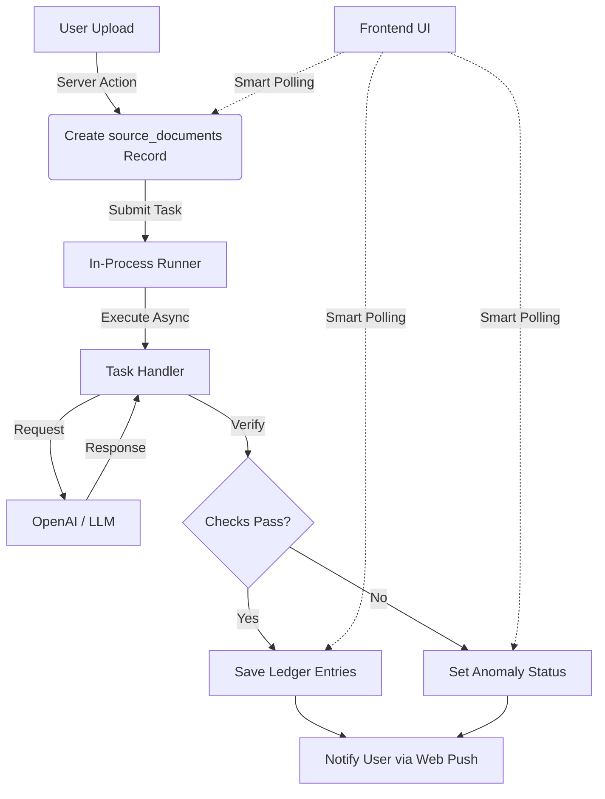
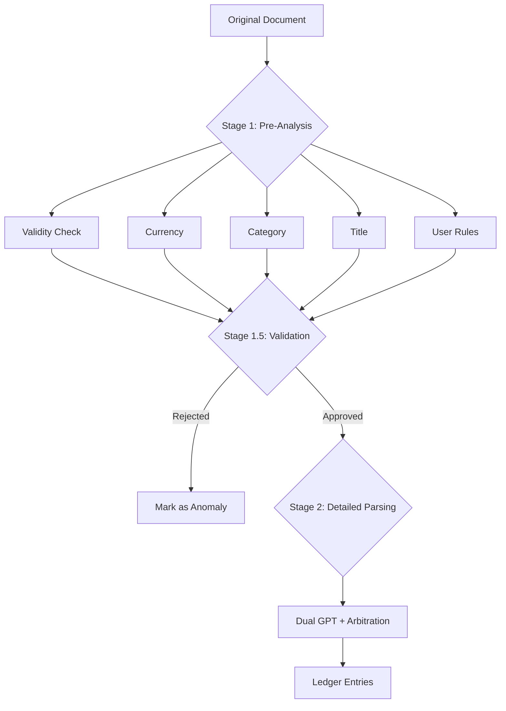

# AI Pipeline Architecture

Cashier uses a simplified asynchronous architecture to process receipts and invoices. This ensures that long-running AI tasks do not block the user interface.

## 1. High-Level Flow Overview

1.  **User Action**: User uploads a file/text via the UI.
2.  **API Layer**: Server Action creates a `source_documents` record with status `queued` and submits it to the **In-Process Task Runner**.
3.  **Async Execution**: The task runner picks up the job immediately in the background (within the same Node.js process).
4.  **AI Processing**: The runner calls OpenAI (or other LLMs) to parse the document.
5.  **Verification & Arbitration**: The system runs checks (Dual GPT) and arbitrates if results conflict.
6.  **Result Persistence**: Valid results are saved to `ledger_entries`; the document status is updated to `completed`.
7.  **Real-time Updates**:
    - **UI Update**: The frontend uses **Smart Polling** (via TanStack Query) to refresh the status every few seconds.



## 2. The Task Runner

Tasks are executed using a lightweight **FlowEngine** (`src/lib/flow/engine.ts`).

- **Execution Model**: "Fire-and-forget" asynchronous execution within the main application process.
- **Lifecycle**:
  - `execute`: Runs the core business logic.
  - `onComplete`: Handles success (save results, notify user).
  - `onError`: Handles errors.
  - `onCancel`: Handles user-initiated cancellation.

- **AI Context**: Tasks have built-in AI capabilities via `context.ai`:
  ```typescript
  const result = await context.ai.generate({
    prompt: "System prompt here",
    messages: [{ role: "user", content: "..." }],
    model: "gpt-4o-mini", // Optional, defaults to OPENAI_MODEL env
    responseFormat: "json_object", // Optional
  });
  // Token usage is automatically tracked!
  ```

**Note**: Since tasks run in-memory, they will be interrupted if the server restarts.

## 3. The Parsing Task: "Dual GPT + Arbitration"

The core logic resides in `src/features/source-document/server/tasks/parse-source-document.ts`. We use a sophisticated **"Consensus & Arbitration"** strategy to ensure accuracy.

### Step 3.1: Dual Execution

The system sends the **same prompt** to the LLM **twice in parallel**.

```typescript
const [result1, result2] = await Promise.all([
  processor.process(payload, options),
  processor.process(payload, options),
]);
```

### Step 3.2: Verification

We compare `result1` and `result2` using strict logic (`verifyAmounts`):

- Do they have the same number of entries?
- Do the total amounts match (per currency)?
- **If they match**: We assume the result is correct.
- **If they differ**: We assume _ambiguity_ or _hallucination_.

### Step 3.3: Arbitration (The "Judge")

If `result1 !== result2`, we invoke a third LLM call: the **Arbitrator**.
The Arbitrator is given:

- The original text/image.
- The two conflicting outputs (`result1` vs `result2`).
- An instruction to decide which one is correct, or if _both_ are wrong.

This significantly reduces "silent failures" where an LLM confidently outputs wrong numbers.

## 5. Multi-Stage Architecture (New)

The parsing pipeline is being refactored into multiple specialized stages for improved accuracy:

### Stage 1: Pre-Analysis (Parallel)

Uses `gemini-3-flash-preview` for fast, parallel pre-checks:

- **1.1 Validity Check**: Is this a valid financial document? (Dual GPT)
- **1.2 Completeness Check**: Is the content complete, with no obvious missing/unreadable areas?
- **1.3 Currency Recognition**: What currencies are present? (Dual GPT)
- **1.4 Category Recognition**: What expense categories are involved? (Dual GPT)
- **1.5 Title Extraction**: Generate a descriptive title
- **1.6 User Requirements**: Parse custom user rules (if any)

The completeness check uses a two-step approach:

1. **Check for total amount first**: If a clear total/sum is present → document is complete
2. **If no total, check line items**: All visible items must have readable amounts

If document is incomplete → Return anomaly early, skip Stage 2.

Each sub-task (except single-GPT tasks) uses Dual GPT + Arbitration for accuracy.

**Files:**

- `stage1-prompts.ts` - Prompt builders
- `stage1-executor.ts` - Parallel execution with arbitration

### Stage 1.5: Validation

A single GPT that reviews Stage 1 results:

- **Veto Power**: Reject if results are clearly inconsistent
- **Consolidation**: Merge results with contextual hints for Stage 2

**File:** `stage1-5-validator.ts`

### Stage 2: Detailed Parsing

Uses `gemini-2.0-pro` (more capable model) for detailed parsing:

- Receives contextual hints from Stage 1.5
- Extracts individual ledger entries
- Uses Dual GPT + Arbitration

**Files:**

- `stage2-prompts.ts` - Prompt builder with context injection
- `stage2-executor.ts` - Dual GPT parsing with arbitration



## 6. Idempotency & Error Handling

- **Idempotency**: The handler performs an "upsert-like" operation: it soft-deletes any existing entries for the source document before inserting new ones.
- **Anomalies**: If the document cannot be parsed (e.g., blurred image, unrelated text), it is not "Failed" (which implies a system crash) but set to `anomaly` status. This prompts the user to review it manually.

---

## 📚 Related Documentation

- [Backend Task Development SOP](./backend_task_development_sop.md) - How to write new tasks
- [Architecture Overview](./architecture_overview.md) - High-level system design
