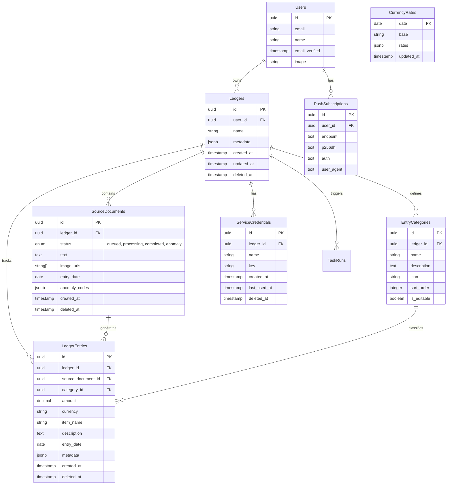

# Database Schema Documentation

Cashier uses **SQLite** as its primary database, with **Drizzle ORM** for schema definition and migrations. The schema is optimized for multi-tenancy (via `ledgers`) and flexible metadata storage.

## 1. Core Entity Relationship Diagram (ERD)

## 2. Table References

### `ledgers` (The Tenant Root)
Every piece of financial data belongs to a Ledger.
-   **`metadata` (JSONB)**: Stores ledger-specific settings like:
    -   `settings.mainCurrency`: The default currency.
    -   `settings.aiLanguage`: Preferred language for AI response.
    -   `settings.aiCustomPrompt`: Custom instructions for AI processing.

### `source_documents` (The Input)
Represents a raw upload (image or text) waiting to be processed.
-   **`status`**: Critical flow control field.
    -   `queued`: Waiting for worker.
    -   `processing`: Worker has picked it up.
    -   `completed`: Successfully parsed.
    -   `anomaly`: Parsed but flagged for review.

### `ledger_entries` (The Output)
The structured financial record.
-   **Relationships**:
    -   `source_document_id`: Links back to the original proof. 
    -   `category_id`: Optional link to user-defined categories.

### `entry_categories`
User-defined or system-provided categories for classifying expenses.

### `service_credentials`
API keys (`sk_live_...`) used for external service integrations.

### `push_subscriptions`
Standard Web Push subscription data for browser notifications.

### `currency_rates` (The Cache)
Daily exchange rates used for stats conversion.

## 3. Metadata & Flexibility
We use `jsonb` columns extensively (in `ledgers`, `ledger_entries`, `source_documents`) to avoid strictly coupled schema migrations for minor feature additions.

## 4. Migration Workflow
Since we use Drizzle ORM:
1.  **Edit Schema**: Modify the `schema.ts` file in the relevant feature folder.
2.  **Generate Migration**: Run `npx drizzle-kit generate`.
3.  **Apply Migration**: This happens via `npx drizzle-kit push` in dev or migration scripts in prod.
