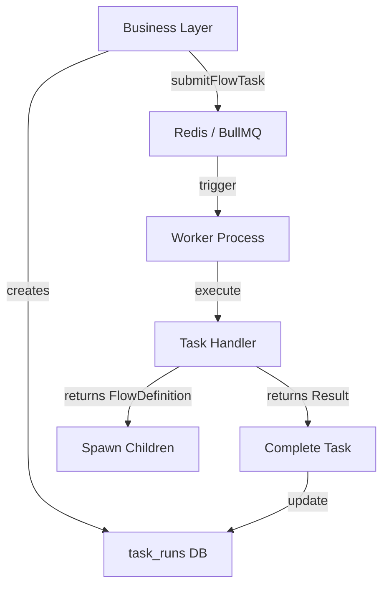

# 后台任务开发 SOP (Standard Operating Procedure)

## 📋 目的

本文档定义了基于 BullMQ 的后台任务系统的标准开发流程，确保：
- ✅ 任务实现一致性（统一接口和生命周期）
- ✅ 正确的错误处理和重试机制
- ✅ 前后端数据同步（Smart Polling + Web Push）
- ✅ 避免常见陷阱（如调用 Next.js 缓存 API）

---

## � 系统架构



**核心组件**：
- **BullMQ + Redis**：任务队列，处理速率限制和失败重试
- **Worker Process**：后台进程，执行任务（main 或 API 队列）
- **Task Handler**：你要实现的业务逻辑
- **task_runs DB**：持久化任务状态

---

## �🎯 何时创建后台任务

### ✅ 应该使用后台任务

| 场景 | 原因 |
|------|------|
| AI 生成内容 | 耗时长，需要速率限制 |
| 批量数据处理 | 防止阻塞 HTTP 请求 |
| 外部 API 调用 | 需要重试和失败恢复 |
| 递归/多步骤流程 | 需要状态追踪和暂停恢复 |

### ❌ 不应该使用后台任务

| 场景 | 原因 | 替代方案 |
|------|------|----------|
| 简单 CRUD | 无需异步 | 直接在 Server Action 中执行 |
| 实时响应 | 用户等不了 | 同步处理 + 乐观更新 |
| 无状态计算 | 不需要追踪 | 在 API Route 中直接返回 |

---

## 🚀 完整开发流程

### Step 1: 规划任务

**问题清单**：
1. 任务的输入和输出是什么？
2. 需要调用外部 API 吗？→ 决定队列选择
3. 是否需要递归/子任务？
4. 失败后如何清理？

**队列选择规则**：

| 队列 | 用途 | 并发限制 | 适用场景 |
|------|------|----------|----------|
| `main` | CPU 密集型/业务逻辑 | 高（如 10） | 数据处理、数据库操作 |
| `api` | 外部 API 调用 | 低（如 3） | OpenAI、外部服务 |

**原则**：
- 调用外部 API → 使用 `api` 队列（防止 429 限流）
- 纯业务逻辑 → 使用 `main` 队列

---

### Step 2: 创建任务文件

**文件位置**：
```
src/features/<feature-name>/server/tasks/<task-name>.ts
```

**示例**：`src/features/ledger/server/tasks/generate-category-metadata.ts`

#### 2.1 定义常量和类型

```typescript
// 1. 定义唯一的任务类型标识符（使用 snake_case）
export const TASK_TYPE = 'generate_category_metadata';

// 2. 定义输入参数类型
export interface GenerateCategoryMetadataInput {
    ledgerId: string;
    categoryId: string;
    categoryName: string;
}

// 3. 定义输出结果类型
export interface GenerateCategoryMetadataOutput {
    icon: string;
    description: string;
}
```

#### 2.2 实现任务处理器

```typescript
import { registerFlowTask, FlowTaskHandler, FlowContext } from '@/lib/flow';
import { db } from '@/lib/db';
import { entryCategories } from '@/lib/db/schema';
import { eq } from 'drizzle-orm';
import { sendNotificationToUser } from '@/features/notifications/server/services/push-service';

// 4. 实现处理器
const handler: FlowTaskHandler<GenerateCategoryMetadataInput, GenerateCategoryMetadataOutput> = {
    
    // 【可选】Step 0: 前置验证
    async validate(input, context) {
        // 验证输入参数
        if (!input.ledgerId || !input.categoryId) {
            throw new Error('Missing required fields');
        }
        
        // 验证资源存在性
        const category = await db.query.entryCategories.findFirst({
            where: eq(entryCategories.id, input.categoryId)
        });
        
        if (!category) {
            throw new Error(`Category ${input.categoryId} not found`);
        }
    },
    
    // 【必须】Step 1: 主执行逻辑
    async execute(input, context) {
        // 更新进度（可选，前端可以展示）
        await context.updateProgress({ 
            currentStep: 'Generating metadata',
            progress: 50 
        });
        
        // 调用 AI 生成内容
        const result = await generateMetadataWithAI(input.categoryName);
        
        // 返回结果
        return {
            icon: result.icon,
            description: result.description
        };
    },
    
    // 【必须】Step 2: 成功回调
    async onComplete(output, input, context) {
        // ⚠️ 重要：这个函数必须是幂等的（可能被调用多次）
        
        // 写入数据库
        await db.update(entryCategories)
            .set({
                icon: output.icon,
                description: output.description,
                updatedAt: new Date()
            })
            .where(eq(entryCategories.id, input.categoryId));
        
        // 发送 Web Push 通知（前端会收到并自动刷新）
        await sendNotificationToUser({
            userId: context.userId!,
            title: 'Category Updated',
            body: `Icon and description generated for ${input.categoryName}`
        });
        
        // ❌ 禁止：不要调用 revalidatePath 或 revalidateTag
        // revalidatePath('/ledger'); // ❌ 错误！Worker 没有 HTTP 上下文
    },
    
    // 【必须】Step 3: 失败回调
    async onError(error, input, context) {
        console.error(`Task failed for category ${input.categoryId}:`, error);
        
        // 可选：记录失败日志到数据库
        // 可选：发送失败通知
        await sendNotificationToUser({
            userId: context.userId!,
            title: 'Generation Failed',
            body: `Failed to generate metadata: ${error.message}`
        });
    }
};

// 5. 注册任务（文件末尾）
registerFlowTask(TASK_TYPE, handler);
```

---

### Step 3: 注册任务到 Worker

**文件**：`src/instrumentation.ts`（Next.js 15 自动加载）

```typescript
export async function register() {
    if (process.env.NEXT_RUNTIME === 'nodejs') {
        // 导入任务文件，确保 registerFlowTask 被执行
        await import("@/features/ledger/server/tasks/generate-category-metadata");
        
        // 其他任务...
        await import("@/features/source-document/server/tasks/parse-source-document");
        
        // 初始化 Worker（如果启用）
        if (process.env.ENABLE_WORKER === 'true') {
            const { initializeWorkers } = await import("@/lib/flow/workers");
            await initializeWorkers();
        }
    }
}
```

**验证**：启动开发服务器，检查日志是否有任务注册信息。

---

### Step 4: 在业务逻辑中提交任务

**文件**：Server Action 或 API Route

```typescript
import { submitFlowTask } from '@/lib/flow/producer';
import { TASK_TYPE } from '@/features/ledger/server/tasks/generate-category-metadata';

export async function createCategoryAction(ledgerId: string, data: { name: string }) {
    // 1. 先创建数据库记录（icon/description 为 null）
    const category = await db.insert(entryCategories).values({
        ledgerId,
        name: data.name,
        icon: null,  // ← 前端 Smart Polling 会检测到这个
        description: null,
        createdAt: new Date()
    }).returning();
    
    // 2. 提交后台任务
    await submitFlowTask({
        type: TASK_TYPE,
        title: `Generate metadata for ${data.name}`,
        ledgerId,
        data: {
            ledgerId,
            categoryId: category.id,
            categoryName: data.name
        },
        queueName: 'api' // ← 调用 AI，使用 api 队列
    });
    
    // 3. 立即返回（不等待任务完成）
    return { success: true, data: category };
}
```

---

### Step 5: 前端监听任务完成

**使用 Smart Polling**（参考 `frontend_data_sync_sop.md`）

```typescript
import { useSmartPolling } from '@/hooks/use-smart-polling';

const { data: categories } = useSmartPolling({
    queryKey: ['categories', ledgerId],
    queryFn: () => getCategoriesAction(ledgerId),
    // 只要有分类缺少 icon/description，就继续轮询
    isActive: (data) => data?.some(c => !c.icon || !c.description) ?? false,
    interval: 3000
});
```

**工作流程**：
```
用户创建分类
    ↓
Server Action 创建数据库记录（icon: null）
    ↓
Server Action 提交后台任务
    ↓
立即返回 → 前端显示临时分类
    ↓
Smart Polling 检测到 icon 为 null → 开始轮询
    ↓
后台任务执行 → AI 生成 → 写入数据库 → 发送 Web Push
    ↓
Smart Polling 检测到 icon 已有值 → 自动停止
    ↓
前端自动更新 UI ✅
```

---

## 📚 高级场景

### 场景 A: 递归任务（父子关系）

```typescript
const handler: FlowTaskHandler<ParentInput, ParentOutput> = {
    async execute(input, context) {
        if (input.needsChildren) {
            // 返回子任务定义（而不是返回结果）
            return {
                name: CHILD_TASK_TYPE,
                title: 'Child Task',
                queueName: 'main',
                data: { parentId: input.id }
            } as FlowDefinition;
        }
        
        return { result: 'No children needed' };
    },
    
    // 【可选】子任务完成后的回调
    async onChildrenCompleted(childrenResults, input, context) {
        // childrenResults 包含所有子任务的输出
        const aggregated = childrenResults.map(r => r.data);
        
        // 写入最终结果
        await db.update(parentTable).set({ result: aggregated });
    }
};
```

### 场景 B: 多个并行子任务

```typescript
async execute(input, context) {
    // 返回数组 = 并行执行
    return [
        { name: 'task_a', data: { ... }, queueName: 'main' },
        { name: 'task_b', data: { ... }, queueName: 'api' },
        { name: 'task_c', data: { ... }, queueName: 'main' }
    ] as FlowDefinition[];
}
```

### 场景 C: 取消任务

```typescript
const handler: FlowTaskHandler<Input, Output> = {
    // ... execute, onComplete, onError
    
    async onCancel(input, context) {
        // 清理资源（如删除临时文件）
        await cleanupTempFiles(input.tempFileId);
        
        // 更新数据库状态
        await db.update(jobs).set({ 
            status: 'cancelled' 
        }).where(eq(jobs.id, input.jobId));
    }
};
```

---

## ✅ 检查清单

在提交 PR 前，确认以下事项：

### 代码质量
- [ ] 定义了清晰的 `Input` 和 `Output` 类型
- [ ] `TASK_TYPE` 使用 `snake_case` 命名
- [ ] 实现了 `execute`, `onComplete`, `onError` 三个核心方法
- [ ] `onComplete` 是幂等的（可多次执行不会出错）

### 队列选择
- [ ] 调用外部 API → 使用 `api` 队列
- [ ] 纯业务逻辑 → 使用 `main` 队列

### 禁止事项
- [ ] ❌ 没有调用 `revalidatePath` 或 `revalidateTag`
- [ ] ❌ 没有在任务中直接操作 Next.js 缓存

### 前端集成
- [ ] 使用 Smart Polling 监听任务完成
- [ ] `isActive` 条件正确匹配任务状态
- [ ] 在 `onComplete` 中调用 `sendNotificationToUser`

### 注册
- [ ] 在 `instrumentation.ts` 中导入任务文件
- [ ] 启动服务器后确认任务已注册

---

## 🚫 常见错误

### ❌ 错误 1: 在 Worker 中调用 Next.js API

```typescript
// ❌ 错误
async onComplete(output, input, context) {
    await updateDatabase(output);
    revalidatePath('/dashboard'); // ❌ Worker 没有 HTTP 上下文
}

// ✅ 正确
async onComplete(output, input, context) {
    await updateDatabase(output);
    await sendNotificationToUser({ ... }); // ✅ 前端通过轮询/推送感知变化
}
```

### ❌ 错误 2: 忘记注册任务

```typescript
// ❌ 文件末尾
registerFlowTask(TASK_TYPE, handler);

// ❌ 但忘记在 instrumentation.ts 中导入
// 结果：任务提交后找不到处理器
```

### ❌ 错误 3: 队列选择错误

```typescript
// ❌ 调用 OpenAI，却用 main 队列
await submitFlowTask({
    type: 'ai_generation',
    queueName: 'main', // ❌ 应该用 'api'
    data: { ... }
});

// 结果：并发过高，触发 OpenAI 429 限流
```

### ❌ 错误 4: onComplete 不幂等

```typescript
// ❌ 可能重复执行导致数据重复
async onComplete(output, input, context) {
    // 每次都插入，不检查是否已存在
    await db.insert(results).values({ ... });
}

// ✅ 幂等设计
async onComplete(output, input, context) {
    // 使用 upsert 或先检查再插入
    await db.insert(results).values({ ... })
        .onConflictDoUpdate({ ... });
}
```

---

## 📚 参考资料

### 项目内示例

| 任务 | 文件路径 | 特点 |
|------|---------|------|
| AI 生成分类元数据 | `src/features/ledger/server/tasks/generate-category-metadata.ts` | 简单 AI 调用 |
| 解析账单图片 | `src/features/source-document/server/tasks/parse-source-document.ts` | 复杂递归任务 |

### 相关文档
- [前端数据同步 SOP](file:///hdd1/docker/apps/Cashier/docs/frontend_data_sync_sop.md) - Smart Polling 使用指南
- [Processing Task Guide](file:///hdd1/docker/apps/Cashier/docs/processing_task_guide.md) - 架构原理

---

## 🔄 文档维护

- **创建时间**: 2026-02-02
- **最后更新**: 2026-02-02
- **维护者**: 开发团队
- **更新策略**: 遇到新的任务模式时补充案例
