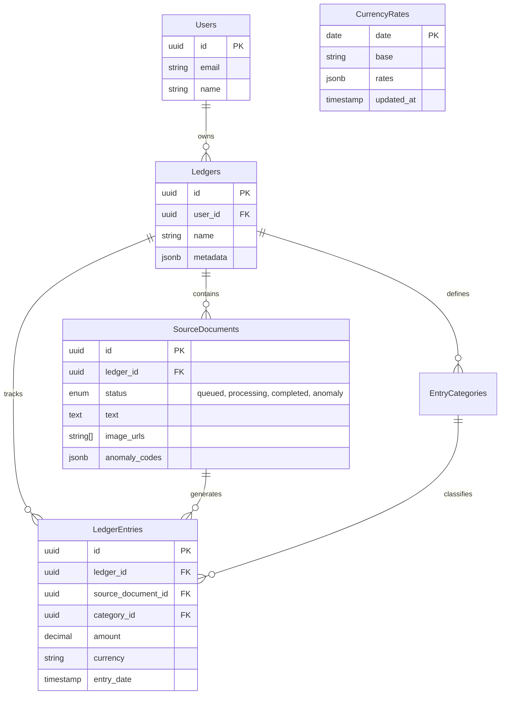

# Database Schema Documentation

Cashier uses **PostgreSQL** as its primary database, with **Drizzle ORM** for schema definition and migrations. The schema is optimized for multi-tenancy (via `ledgers`) and flexible metadata storage.

## 1. Core Entity Relationship Diagram (ERD)



## 2. Table References

### `ledgers` (The Tenant Root)
Every piece of financial data belongs to a Ledger.
-   **`metadata` (JSONB)**: Stores ledger-specific settings like:
    -   `settings.mainCurrency`: The default currency.
    -   `settings.aiLanguage`: Preferred language for AI response.
    -   `settings.autoRecognizeDate`: Boolean to enable/disable date extraction.

### `source_documents` (The Input)
Represents a raw upload (image or text) waiting to be processed.
-   **`status`**: Critical flow control field.
    -   `queued`: Waiting for worker.
    -   `processing`: Worker has picked it up.
    -   `completed`: Successfully parsed.
    -   `anomaly`: Parsed but flagged for review (e.g., mismatch, unknown currency).
-   **`anomaly_codes`**: Array of reasons why it was flagged (`invalid_content`, `evidence_anomaly`).

### `ledger_entries` (The Output)
The structured financial record.
-   **Relationships**:
    -   `source_document_id`: Links back to the original proof. If a document is re-parsed, these entries may be deleted and recreated.
    -   `category_id`: Optional link to user-defined categories.

### `currency_rates` (The Cache)
Daily exchange rates used for stats conversion.
-   **`date`**: Primary key (YYYY-MM-DD).
-   **`rates`**: JSONB containing rate mappings (e.g., `{"USD": 1.1, "CNY": 7.8}`).
-   **`base`**: The base currency for these rates (usually `EUR`).

## 3. Metadata & Flexibility
We use `jsonb` columns extensively to avoid strictly coupled schema migrations for minor feature additions.

**Example: `SourceDocMetadata`**
```typescript
interface SourceDocMetadata {
    rawOcrText?: string;      // Debugging data
    emailHeaders?: {          // If uploaded via email
        from?: string;
        subject?: string;
    };
    fileMeta?: {
        mimeType?: string;
        sizeBytes?: number;
    };
}
```

## 4. Migration Workflow
Since we use Drizzle ORM:
1.  **Edit Schema**: Modify the `schema.ts` file in the relevant feature folder.
2.  **Generate Migration**: Run `npx drizzle-kit generate`.
3.  **Apply Migration**: This happens automatically on app startup (via `npm run db:push` in dev, or migration scripts in prod).
