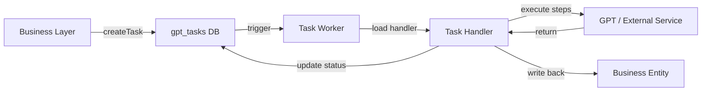

# GPT Task Infrastructure Development Guide

This guide provides a comprehensive overview of the GPT task infrastructure designed for decoupled, robust, and asynchronous task management.

## 🏗 Architecture Overview

The infrastructure is split into two main parts:
1. **Core Infrastructure (`src/lib/gpt/`)**: A pure, business-agnostic engine responsible for task queuing, execution coordination, and state management.
2. **Task Implementations (`src/lib/tasks/`)**: Where business-specific logic resides (e.g., source document parsing, summarization).

### The Data Flow


---

## 🛠 Implementing a New Task

To add a new GPT-powered feature, follow these steps:

### 1. Define Input/Output Types
Create a file in `src/lib/tasks/` (e.g., `my-feature.ts`).

```typescript
export interface MyFeatureInput {
  entityId: string;
  options: Record<string, any>;
}
```

### 2. Implement `TaskHandler`
Implement the `TaskHandler` interface.

```typescript
import { registerTask, TaskHandler } from "@/lib/gpt";

const myFeatureHandler: TaskHandler<MyFeatureInput, string> = {
  // 1. Core Logic
  async execute(task, context) {
    const input = task.input as MyFeatureInput;
    
    // Use context to track progress
    await context.updateProgress({ currentStep: "analyzing" });
    
    // Call GPT...
    const result = "GPT output";
    
    return result;
  },

  // 2. Business Write-back
  async onComplete(output, task) {
    // Final validation: entityId exists?
    // Update business table...
  },

  // 3. Error Cleanup
  async onError(error, task) {
    // Mark business entity as failed...
  }
};

// 3. Register IT
registerTask("my_feature_type", myFeatureHandler);
```

### 3. Register in Tasks Index
Import your file in `src/lib/tasks/index.ts` to ensure it registers at startup.

---

## 📡 Using Tasks in Business Logic

### Create a Task
```typescript
import { createTask } from "@/lib/gpt";

const { taskId } = await createTask({
  type: "my_feature_type",
  title: "Analyzing something...",
  ledgerId: ledgerId,
  entityId: recordId,
  entityType: "my_entity", // Optional metadata
  input: { ... },
});
```

### Track Progress (Frontend)
Use `fetchGptTasks(ledgerId)` to get the latest status. The `TaskCenter` component already displays this information for any task type.

---

## 🛡 Best Practices

### 1. Final Commit Validation
**Always** re-verify the existence and status of your business entity in `onComplete` or at the end of `execute`.
> GPT execution is slow; the world might have changed while GPT was "thinking" (e.g., user deleted the record).

### 2. Best-Effort Semantics
The GPT infrastructure does **not** guarantee retries.
- If it fails, it marks the task as `failed`.
- The UI should detect `failed` state and offer a "Retry" button that creates a **new** task.

### 3. Progressive Checkpoints
For multi-step tasks, use `context.updateProgress` to save intermediate data in the `progress.data` field. This helps with debugging and provides rich UI feedback.

### 4. Purity
Do **not** import business models (`source_documents`, `ledger_entries`, etc.) inside `src/lib/gpt`. Keep those imports strictly within `src/lib/tasks`.

### 5. Concurrency Configuration
The number of concurrent worker loops can be controlled via the environment variable:
- `GPT_WORKER_COUNT`: Set this in your `.env` files (default is 1).
