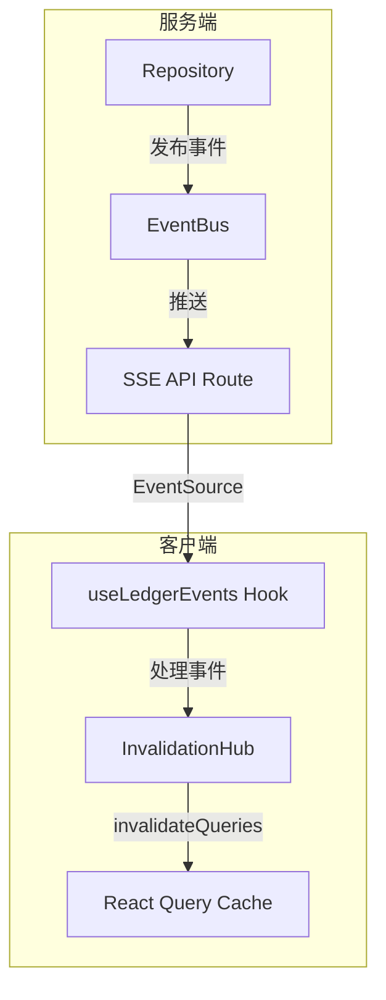

# SSE 实时更新接入指南

本文档介绍如何在 Cashier 项目中接入 Server-Sent Events (SSE) 实时更新系统。

## 架构概览



## 核心组件

### 1. 服务端事件发布

#### EventBus (`src/lib/events/event-bus.ts`)

单例模式的事件总线，负责发布和订阅事件。

```typescript
import { eventBus } from '@/lib/events/event-bus';

// 发布事件
eventBus.publish({
    type: 'entity:changed',
    ledgerId: 'xxx',
    entity: 'ledger_entry',  // 实体类型
    action: 'created',        // 操作类型: created | updated | deleted
    ids: ['entry-id-1', 'entry-id-2']  // 受影响的实体ID
});
```

#### Repository 模式自动发布

推荐使用 Repository 模式，CRUD 操作会自动发布事件。Repository 通常位于 `src/features/<feature>/server/repository.ts`。

```typescript
// src/features/ledger/server/repository.ts
class LedgerEntryRepository extends BaseRepository<LedgerEntry> {
    constructor() {
        super(ledgerEntries, 'ledger_entry');
    }
}

// 使用 - 事件会自动发布
const entry = await ledgerEntryRepository.create({
    ledgerId: 'xxx',
    amount: 100,
    // ...
});
```

目前支持的实体类型：

| EntityType | 说明 |
|------------|------|
| `ledger_entry` | 账目记录 |
| `source_document` | 原始凭证 |
| `task_run` | 任务执行记录 |
| `category` | 分类 |
| `ledger` | 账本 |
| `service_credential` | 服务凭据 |

### 2. SSE API 端点

路由位于 `src/app/api/ledgers/[id]/events/route.ts`

客户端通过 `GET /api/ledgers/{ledgerId}/events` 建立 SSE 连接。

### 3. 客户端事件订阅

#### useLedgerEvents Hook (`src/lib/events/use-ledger-events.ts`)

在需要实时更新的页面顶层调用：

```typescript
import { useLedgerEvents } from '@/lib/events/use-ledger-events';

function LedgerPage() {
    const ledgerId = 'xxx';
    
    // 启用实时更新 - 会自动建立SSE连接
    useLedgerEvents(ledgerId);
    
    // ... 其他逻辑
}
```

#### InvalidationHub (`src/lib/events/invalidation-hub.ts`)

自动处理事件并使相关 React Query 缓存失效。建议使用 `queryKeys` 工厂来保证 key 的一致性：

```typescript
import { queryKeys } from "@/lib/query-keys";

// 事件 -> 缓存失效映射
const invalidationMap = {
    ledger_entry: [
        queryKeys.ledgerEntries(ledgerId),  // 条目列表
        queryKeys.summary(ledgerId),        // 摘要统计
        queryKeys.ledger(ledgerId),         // 账本详情
    ],
    // ...
};
```

## 如何接入新功能

### 步骤 1: 使用 Repository 进行数据操作

如果是新实体，创建对应的 Repository（建议在 `src/features/<feature>/server/` 下）：

```typescript
// src/features/my-feature/server/repository.ts
import { BaseRepository } from '@/lib/repositories/base-repository';
import { myEntities } from './schema';
import { MyEntity } from '@/types/api';

class MyEntityRepository extends BaseRepository<MyEntity, typeof myEntities> {
    constructor() {
        super(myEntities, 'my_entity');  // 第二个参数是 EntityType
    }
    
    // 添加自定义查询方法
    async findByLedgerId(ledgerId: string) {
        return this.db.select()
            .from(this.table)
            .where(eq(myEntities.ledgerId, ledgerId));
    }
}

export const myEntityRepository = new MyEntityRepository();
```

### 步骤 2: 添加 EntityType

在 `src/lib/events/types.ts` 中添加新的实体类型：

```typescript
export type EntityType = 
    | 'ledger_entry' 
    | 'source_document' 
    | 'task_run' 
    | 'category' 
    | 'ledger' 
    | 'service_credential'
    | 'my_entity';  // 新增
```

### 步骤 3: 配置缓存失效规则

在 `src/lib/events/invalidation-hub.ts` 中添加映射：

```typescript
const invalidationMap: Record<string, string[][]> = {
    // ... 现有映射
    my_entity: [
        ['myEntities', ledgerId],      // 主查询键
        ['relatedData', ledgerId],     // 关联数据
    ],
};
```

### 步骤 4: 定义数据获取 Hook

使用与失效规则一致的 Query Key：

```typescript
// src/hooks/useMyEntityData.ts
export function useMyEntityData(ledgerId: string) {
    return useQuery({
        // 注意：queryKey 必须与 invalidationMap 中的键匹配
        queryKey: ['myEntities', ledgerId],
        queryFn: () => fetchMyEntities(ledgerId),
    });
}
```

> [!IMPORTANT]
> **Query Key 必须匹配！** `useQuery` 中的 `queryKey` 前缀必须与 `invalidationHub` 中的键一致，否则缓存不会被正确失效。

### 步骤 5: 在页面启用 SSE

确保页面调用了 `useLedgerEvents`:

```typescript
function MyPage() {
    const ledgerId = useParams().id;
    
    // 启用 SSE
    useLedgerEvents(ledgerId);
    
    // 使用数据
    const { data } = useMyEntityData(ledgerId);
    
    return <div>...</div>;
}
```

## Query Key 命名约定

为确保 SSE 失效正常工作，请遵循以下约定：

| 数据类型 | Query Key 格式 | 示例 |
|----------|---------------|------|
| 列表查询 | `[entityName (复数), ledgerId, ...filters]` | `['ledgerEntries', ledgerId, 'pending']` |
| 单条查询 | `[entityName (单数), ledgerId, entityId]` | `['ledger', ledgerId]` |
| 统计数据 | `[statName, ledgerId, ...params]` | `['summary', ledgerId]` |

## 调试

### 查看 SSE 连接

在浏览器 DevTools 的 Network 面板中，过滤 "EventStream" 类型，可以看到 `/api/ledgers/{id}/events` 的连接。

### 查看事件日志

控制台会输出 SSE 相关日志：

```
[SSE] Creating EventSource connection for ledger: xxx
[SSE] Connection opened
[SSE] Received message: {"type":"entity:changed",...}
[SSE Invalidation] Handling event: {...}
```

### 常见问题

1. **数据不更新？**
   - 检查是否调用了 `useLedgerEvents`
   - 检查 Query Key 是否与 invalidationMap 匹配
   - 查看控制台是否有 SSE 连接和事件日志

2. **SSE 连接断开？**
   - EventSource 会自动重连
   - 检查服务端是否正常响应

3. **多标签页更新？**
   - SSE 仅在当前进程内生效
   - 如需跨标签页更新，考虑使用 BroadcastChannel API

## 最佳实践

### 1. 使用 Query Key 常量（推荐）

为避免 Query Key 与失效规则不一致，建议使用集中定义的常量：

```typescript
// src/lib/query-keys.ts
export const queryKeys = {
    // === Ledger ===
    ledger: (ledgerId: string) => ['ledger', ledgerId] as const,
    ledgers: () => ['ledgers'] as const,

    // === Ledger Entries ===
    ledgerEntries: (ledgerId: string, ...filters: (string | undefined)[]) =>
        ['ledgerEntries', ledgerId, ...filters.filter(Boolean)] as const,

    // === Source Documents ===
    sourceDocuments: (ledgerId: string, ...filters: (string | undefined)[]) =>
        ['sourceDocuments', ledgerId, ...filters.filter(Boolean)] as const,

    // === Categories ===
    entryCategories: (ledgerId: string) => ['entryCategories', ledgerId] as const,

    // === Summary & Stats ===
    summary: (ledgerId: string, ...params: (string | undefined)[]) =>
        ['summary', ledgerId, ...params.filter(Boolean)] as const,
    tokenStats: (ledgerId: string) => ['token-stats', ledgerId] as const,

    // === Tasks ===
    processingTasks: (ledgerId: string) => ['processingTasks', ledgerId] as const,

    // === Service Credentials ===
    serviceCredentials: (ledgerId: string) => ['serviceCredentials', ledgerId] as const,
} as const;
```

**使用方式：**

```typescript
// 组件中
import { queryKeys } from '@/lib/query-keys';

const { data } = useQuery({
    queryKey: queryKeys.ledgerEntries(ledgerId, 'pending'),
    queryFn: () => fetchLedgerEntries(ledgerId, { status: 'pending' }),
});
```

```typescript
// invalidation-hub.ts 中
import { queryKeys } from '@/lib/query-keys';

const invalidationMap = {
    ledger_entry: [
        queryKeys.ledgerEntries(ledgerId),
        queryKeys.summary(ledgerId),
    ],
};
```

> [!TIP]
> 使用 `as const` 可以获得精确的类型推断，IDE 会自动补全 Key 的内容。

### 2. 其他最佳实践

- **统一使用 Repository** - 避免直接操作数据库，确保事件正确发布
- **保持 invalidationMap 同步** - 添加新数据类型时同步更新映射
- **适度失效** - 只失效真正需要更新的查询，避免过度刷新
- **组件就近获取** - 让组件自己调用 `useQuery` 获取所需数据，而非从顶层传递

## 相关文件

| 文件 | 说明 |
|------|------|
| [query-keys.ts](file:///Users/xiangyu/Projects/Cashier/src/lib/query-keys.ts) | Query Key 常量定义 |
| [event-bus.ts](file:///Users/xiangyu/Projects/Cashier/src/lib/events/event-bus.ts) | 事件总线 |
| [invalidation-hub.ts](file:///Users/xiangyu/Projects/Cashier/src/lib/events/invalidation-hub.ts) | 缓存失效处理 |
| [use-ledger-events.ts](file:///Users/xiangyu/Projects/Cashier/src/lib/events/use-ledger-events.ts) | SSE 订阅 Hook |
| [base-repository.ts](file:///Users/xiangyu/Projects/Cashier/src/lib/repositories/base-repository.ts) | Repository 基类 |

