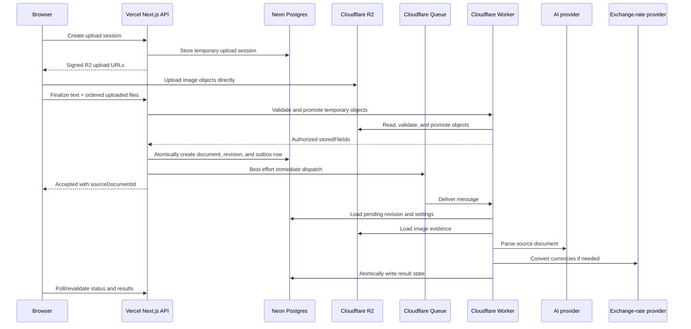
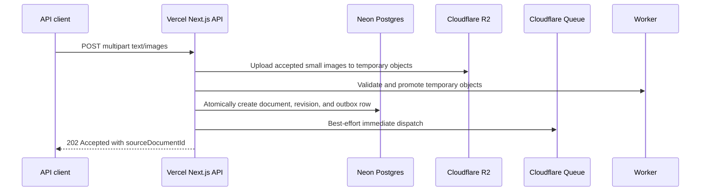

# Vercel and Cloudflare Rewrite Design

Date: 2026-07-09
Updated: 2026-07-10

## Goal

Rebuild Cashier as a Vercel-native Next.js application with a Cloudflare-backed file and background-processing layer.
This is not a compatibility migration. It is a new architecture that keeps the Warm Ledger visual experience and the
hard-won bookkeeping behavior while replacing the old backend, task model, storage, tests, caching, and deployment
shape.

The user-facing product should still feel like the current Warm Ledger app: calm, warm, compact, source-document-first,
and personal. The internals should be simpler, more reliable on Vercel, easier to deploy, and easier to reason about.

This repository is already an isolated rewrite copy. It has no obligation to keep the legacy application runnable or to
preserve a deployable transition path while the rewrite is in progress.

## Non-Goals

- No full visual redesign of the Warm Ledger UI.
- No old SQLite migration preservation, data import, compatibility schema, or rollback path to the SQLite application.
- No requirement for intermediate rewrite commits to run the legacy application.
- No in-process background task runtime.
- No Vercel Cron dependency.
- No Vercel Blob dependency.
- No public read API surface for entries, stats, task items, or source documents in the first version.
- No standalone task center, cancel task, dismiss task, batch retry, batch delete, or export.
- No AI auto-categorization of historical entries.
- No AI category icon or metadata generation.
- No image editor, crop, or draw tools.
- No password login, OAuth, SSO, change email, clear data, or delete account.
- No Docker production path.
- No real OpenAI, R2, Neon, or Resend calls in default CI.

## Design Principles

- Preserve business invariants, not old files.
- Preserve visual identity, not old component boundaries.
- Rewrite application code destructively, but restore product capabilities in small, verified vertical slices.
- Extract only the reviewed behavioral evidence needed to test retained product behavior; do not migrate legacy modules
  or runtime guarantees into the new architecture.
- Store bookkeeping facts in the database; keep runtime attempts out of UI state derivation.
- Treat each AI parse attempt as an immutable input snapshot.
- Keep user-facing status simple even when the processing pipeline has retries and failures.
- Avoid Vercel-specific platform features that would make future Cloudflare migration harder.
- Use external services behind narrow adapters.
- Prefer small, explicit query surfaces over broad hydrated bootstrap payloads.
- Use tests as guardrails for core behavior, not as anchors to the old architecture.

## Chosen Stack

### Vercel

Vercel hosts the Next.js app:

- Next.js App Router and React.
- Server Components for shell and initial data.
- Route Handlers for web APIs and API v1 ingestion.
- Auth.js for email OTP sessions.
- Resend for OTP email delivery.
- Drizzle queries against Neon Postgres.
- R2 upload calls.
- Cloudflare Queue enqueue calls.

Vercel does not run the long background parser and does not depend on Vercel Cron.

### Cloudflare

Cloudflare hosts the internal processing and storage layer:

- R2 stores source-document images.
- Queues carries parse work from the Vercel app to the Worker.
- A small scheduled Worker dispatches stale transactional-outbox rows into Queues. It is a delivery repair mechanism,
  not a parser or a cron-centered task runtime.
- An authenticated internal Worker endpoint validates uploaded image bytes and promotes temporary objects into durable
  stored files without routing those bytes through Vercel.
- Worker consumes queue messages, reads revision evidence, calls AI and exchange-rate providers, and writes normalized
  results into Postgres.

The browser and external API clients do not call internal Worker endpoints directly. Vercel authenticates internal
validation calls. Browser reads may use short-lived R2 GET capability URLs issued only after Vercel authorizes a stored
file request.

### Neon and Drizzle

Neon Postgres is the source of truth. Drizzle owns the schema, migrations, and typed query layer.

D1 is not the primary database because this product needs Postgres-friendly numeric amounts, constraints, relationships,
querying, and write-time exchange-rate facts. Web and Worker use `@neondatabase/serverless` through Drizzle's
`neon-serverless` driver so both deploy targets support the required transactions. Hyperdrive is not part of v1.

### AI

The AI adapter is OpenAI-compatible, not OpenAI-only:

- `AI_BASE_URL`
- `AI_API_KEY`
- `AI_MODEL`

Business code calls one source-document parser. It must not know whether a specific provider internally treats the
request as text, vision, or multimodal.

## Deployment Shape

Use a small monorepo-style boundary:

```text
apps/web        -> Vercel Next.js app
apps/worker     -> Cloudflare Worker queue consumer
packages/db     -> Drizzle schema, migrations, query helpers
packages/core   -> shared domain types, parser contracts, money/date helpers
```

The exact package layout can be adjusted during implementation, but these deploy targets must remain separate. The
Worker should not be hidden inside the Next.js app, and the web app should not depend on a constantly running server.

## Request, Upload, and Processing Flow

There are two ingestion paths.

### Web Upload Path

The web UI must not send large images through a Vercel Route Handler. Browser image upload uses an upload session and
direct-to-R2 signed uploads.

Rules:

- Pure text submit does not need an upload session.
- Image or mixed submit creates a temporary upload session.
- The web app asks Vercel for temporary signed R2 upload URLs.
- Signed upload URLs are bearer-capability URLs. They are short-lived, PUT-only, cannot read objects, and expire after
  15 minutes.
- Browser-visible upload keys are temporary session keys, not durable revision file keys.
- Browser compression is best effort. The uploaded artifact must still satisfy the configured normalized per-file,
  total-revision, and pixel limits even when compression fails.
- Finalize creates the source document only after uploaded R2 objects are verified and promoted by the internal
  validation Worker.
- Validation checks object ownership, actual MIME magic bytes, byte size, SHA-256, pixel dimensions, decode safety, and
  display order. Browser-provided MIME type and image metadata are not trusted.
- Web limits are 10 images, 20 MB per original image, and 20k text characters.
- Normalized upload defaults are 4 MB per image, 20 MB total per revision, and 16 megapixels per image. They remain
  environment-configurable, but deployments may only raise them after verifying Worker and AI-provider memory limits.
- Direct upload must use a private upload prefix, strict CORS, expected `Content-Type`, checksum metadata/header, session
  rate limits, and per-user upload-session quotas.

This avoids Vercel's request-body limit for normal web usage and keeps image bytes out of the Vercel function runtime
except for small metadata requests.



### External API Upload Path

The external API stays deliberately convenient and small. It accepts `multipart/form-data` through Vercel and uploads
accepted image files to R2 server-side.

Rules:

- API max total request body is 4 MB.
- API max image count is 3.
- API max single image is 3 MB.
- API max text is 10k characters.
- Requests above the limit return `413` and tell the caller to use the web app.
- API clients do not get upload sessions, signed R2 URLs, R2 keys, or direct storage access.

This keeps the API useful for quick capture integrations while making large or careful uploads a web workflow.



### Cross-Service Failure Rules

The first version uses a transactional outbox because a database commit and Queue enqueue cannot be atomic across
providers. Immediate enqueue is an optimization; the outbox is the durability boundary.

Rules:

- Web finalize R2 verification fails: do not create a source document.
- API server-side temporary upload fails before validation: do not create a source document. The temporary-prefix
  lifecycle removes any partial or abandoned objects.
- DB creation fails after file promotion: do not create a source document. An already promoted durable stored file may
  remain orphaned in v1; it must never become readable without an owning source-document relationship.
- Source-document creation, pending-revision creation, and outbox insertion happen in one Postgres transaction.
- The web request attempts immediate dispatch after commit. A crash or Queue failure leaves the outbox row pending, not
  lost.
- A Cloudflare Scheduled Trigger scans a bounded batch of stale outbox rows and retries enqueue. It does not parse
  revisions.
- Outbox claim and completion use leases or compare-and-set updates so immediate and scheduled dispatchers cannot create
  uncontrolled duplicate sends. Queue consumers remain idempotent because a send can still be duplicated.
- If the configured outbox delivery policy is exhausted, mark the still-current pending revision `failed` with
  `failure_code = queue_enqueue_failed`. Until then the revision remains `processing`.
- Web and API responses return the created source-document ID after the DB transaction commits, even when immediate
  dispatch fails, because durable delivery is represented by the outbox row.
- Worker-recognized terminal outcomes write revision state directly.
- Queue retries that are exhausted go to a Cloudflare Queue DLQ. The DLQ consumer marks the still-pending revision
  `failed` with `failure_code = queue_exhausted`.
- DLQ updates must be guarded by current `pending_revision_id`; an exhausted old message must not overwrite a newer
  pending or active revision.

AI raw output, prompts, provider errors, R2 keys, and internal attempt details never go to the normal browser read model.
The Worker writes sanitized entries, user-facing anomaly reasons, and stable internal error codes to the database.
The Vercel app can show stable failure codes to the signed-in user for diagnosis, but not secrets or raw provider
payloads.

Queue delivery is treated as at-least-once. The Worker must be idempotent:

- process a revision only if it is still the source document's `pending_revision_id`;
- skip or record a discarded attempt if the revision is no longer pending;
- claim work with an atomic lease/CAS operation containing a unique lease token and expiry;
- configure the lease to exceed the bounded R2, AI, and exchange-rate timeout budget; renew it only between stages, and
  stop without finalizing if renewal fails;
- never hold a database transaction or row lock while reading R2 or calling AI and exchange-rate providers;
- finalize only when the revision is still pending, still `processing`, and owned by the same unexpired lease token;
- make entry replacement and revision activation one database transaction;
- never let a stale queue message overwrite a newer active or pending revision.

Failure handling distinguishes retryable delivery failures from terminal revision outcomes:

- transient R2, AI, exchange-rate, or database availability failures retry through Queue and keep the revision
  `processing`;
- non-retryable provider responses, schema failures, and exhausted adapter-local retry policies may write a stable
  terminal failure code;
- a database outage that prevents writing failure state must throw and retry; `database_failed` cannot be promised until
  the database is available to persist it;
- on Queue retry exhaustion, the DLQ consumer discards a revision that is no longer pending, delays itself while another
  unexpired processing lease owns the current revision, and otherwise uses CAS to mark that still-processing revision
  `queue_exhausted`.

## Source Document Data Model

### Tables

Core tables:

- `users`
- `workspaces`
- `source_documents`
- `source_document_revisions`
- `stored_files`
- `source_document_revision_files`
- `source_document_revision_entries`
- `ledger_entries`
- `entry_categories`
- `service_credentials`
- `api_idempotency_keys`
- `processing_attempts`
- `upload_sessions`
- `upload_session_files`
- `processing_outbox`
- `exchange_rate_snapshots`

Each business table includes `workspace_id`. Relationships between workspace-owned tables use composite foreign keys so
rows cannot link across workspaces. Source-document revision pointers use
`(workspace_id, source_document_id, revision_id)` relationships, ensuring the active and pending revisions belong to
both the same workspace and the same source document. Revision files, revision entries, ledger entries, stored files,
categories, attempts, idempotency records, and outbox rows receive equivalent ownership constraints.

### Source Document

`source_documents` is the stable user-facing object.

Important fields:

- `id`
- `workspace_id`
- `type`: `ai` or `manual`
- `active_revision_id`
- `pending_revision_id`
- `created_at`
- `updated_at`
- `deleted_at`

Source-document `type` is only `ai` or `manual`. Text-only, image-only, and mixed evidence are derived from revision
content, not from separate source-document types.

The product is naturally one workspace per user. Implementation may create or resolve a workspace during account setup,
but the product should not speak as though a "single ledger auto-created from a multi-ledger compatibility mode" is a
feature.

### Upload Session

`upload_sessions` and `upload_session_files` are temporary web-upload coordination records, not source documents.

Rules:

- Source document creation happens only on finalize.
- Pure text submissions skip upload sessions.
- A session belongs to one workspace and expires after 15 minutes.
- Each file record stores expected MIME type, byte size, SHA-256, display order, and temporary R2 key. After successful
  validation it stores the promoted `stored_file_id`; validating the same session file again returns that stored file.
- The expected SHA-256 comes from the browser before upload and must be sent with the upload request as checksum
  metadata/header where the storage API supports it.
- Temporary upload keys use a private session prefix and are not reused as durable revision file keys.
- Signed URLs are PUT-only and must not support GET, LIST, DELETE, overwrite outside the assigned key, or arbitrary
  metadata mutation.
- Apply upload-session rate limits and per-user quotas before issuing signed URLs.
- The internal validation Worker reads the uploaded bytes, verifies the session expectations, and promotes valid objects
  into immutable `stored_files` before source-document creation.
- The browser finalizes with ordered upload-session file IDs. Source-document creation resolves only their validated
  stored-file IDs from the same workspace and session; it never accepts user-supplied R2 or stored-file references.
- Finalize is idempotent: the first successful transaction records `finalized_at` and `source_document_id`; concurrent or
  repeated finalize calls return that same source document instead of creating duplicates.
- Expired upload-session metadata may remain in v1. Temporary R2 objects use a bucket lifecycle rule that removes the
  temporary prefix after 24 hours.

### Revision

`source_document_revisions` contains an immutable input snapshot and mutable lifecycle fields for one parse attempt.
Text, file associations, settings snapshot, and parser input version never change after creation; status, lease, result,
and failure fields change only through guarded state transitions.

Important fields:

- `id`
- `workspace_id`
- `source_document_id`
- `kind`: `ai_parse` or `manual_entry`
- `status`: `processing`, `completed`, `failed`, `anomaly`, or `abandoned`
- text snapshot
- parse result snapshot, if any
- user-facing reason fields
- internal reason code fields
- processing lease token and expiry
- timestamps

Every upload, edit, reparse, retry, and manual completion creates a new revision. Historical revisions are preserved but
do not drive current UI state and are not shown by default in Stream/list surfaces.

There is only one pending revision per source document at a time. If a source document already has a pending revision:

- `processing`: user can view and edit locally, but cannot submit a new revision yet;
- `failed` or `anomaly`: retry or edit retry abandons the old pending revision and creates a new pending revision;
- `completed` candidate: user must accept or abandon it before submitting another revision.

Manual entry mutations on a completed source document are rejected while any pending revision exists. Failed/anomaly
manual completion is the explicit exception: it abandons the old pending revision, creates a completed manual revision,
activates its complete entry set, and clears the pending pointer in one transaction.

`processing_attempts` is internal-only. It records Worker attempts, delivery metadata, provider timing, failure stage,
and sanitized diagnostics. It is not the object users retry.

### Processing Outbox

`processing_outbox` stores one versioned parse-dispatch event per AI revision:

- `id`
- `workspace_id`
- `revision_id`
- message contract version
- delivery status and attempt count
- next-attempt timestamp
- dispatcher lease token and expiry
- dispatched and terminal timestamps

The database transaction that creates an AI revision creates or re-arms its outbox row. The Queue payload contains only
the message contract version and revision ID; the Worker loads and authorizes all other facts from Postgres. Dispatchers
may send duplicates, so a dispatched row is evidence of delivery attempt, not proof that parsing ran exactly once.

### Stored Files and Revision Files

`stored_files` is the internal inventory of validated, immutable file objects:

- `id`
- `workspace_id`
- private random R2 object key
- SHA-256
- trusted MIME type
- byte size
- image width and height
- creation timestamp

`source_document_revision_files` stores immutable file evidence for a revision:

- `revision_id`
- `stored_file_id`
- display order

Every revision owns its ordered association rows, while immutable stored files may be referenced by more than one
revision in the same workspace. Retry creates new revision-file rows that reference the same stored files. Edit retry
reuses unchanged stored files and references newly promoted stored files for changed images. Stored files are never
shared across workspaces.

First version does not delete R2 objects, even when a source document is deleted. Access is controlled through database
ownership and source-document visibility, not through object-key secrecy.

### Revision Entries

`source_document_revision_entries` stores parsed or manual entries for a revision before they become official ledger
entries.

Use this table for:

- first parse result before it is atomically applied;
- reparse candidate result when active entries already exist;
- completed manual revision entries;
- historical inspection of what a revision produced.

First AI success when no active entries exist can be applied immediately to `ledger_entries`. AI success when active
entries already exist becomes a completed pending candidate. The user must explicitly accept that candidate before it
replaces official `ledger_entries`.

Manual edits to a completed source document use the same revision model. Adding, editing, or deleting entries on a
completed source document creates a `manual_entry` revision derived from the current active entries plus the user's
changes. That manual revision is completed and activated immediately in the same transaction. Do not mutate an old
revision's facts in place.

### Entries

`ledger_entries` stores active bookkeeping facts:

- `workspace_id`
- `source_document_id`
- `source_document_revision_id`
- `entry_date`
- original amount and currency
- converted amount and main currency
- exchange rate and exchange-rate snapshot reference
- merchant/title/category fields
- soft-delete fields

Details and Stats read entries, not jobs. Only entries from the active completed revision count, unless the entry itself
is soft-deleted.

When a candidate revision is accepted, replacing active entries and moving `active_revision_id` to the candidate revision
must happen in one transaction. The confirmation copy must state that accepting replaces current entries, including any
manual edits. There is no merge, diff, active-entry version conflict check, or automatic rollback in v1.

Replacement means soft-deleting the previous active `ledger_entries`, inserting the complete new active entry set, moving
`active_revision_id`, and clearing `pending_revision_id` in one transaction. Historical facts remain in
`source_document_revision_entries`; callers must not depend on ledger-entry IDs surviving a revision replacement.

## User-Facing State Rules

UI state is derived from a small set of fields:

- `deleted_at`
- `active_revision_id`
- `pending_revision_id`
- pending revision status

Rules:

- `deleted_at` means deleted.
- If `pending_revision_id` exists, show the pending revision status.
- If no pending revision exists and `active_revision_id` exists, show completed.
- No pending and no active is an internal invalid state except during a very short creation transaction.

Scenarios:

- First parse fails or is anomalous: no active revision exists; pending revision shows `failed` or `anomaly`.
- Completed source document reparse fails or is anomalous: old active entries remain valid; pending revision shows
  `failed` or `anomaly`.
- First parse succeeds and no active entries exist: new revision becomes active and entries are written.
- Reparse succeeds while active entries already exist: new revision becomes a completed pending candidate. It does not
  replace active entries until explicit confirmation.
- Completed pending candidate is a derived UI state: `pending_revision.status = completed` while an active revision
  already exists. Suggested label: `新解析结果待确认`.
- Accept candidate: replace official `ledger_entries`, set candidate as active, and clear pending in one transaction.
- Abandon candidate: set pending revision to `abandoned`, clear `pending_revision_id`, and keep active entries.
- Abandon pending: set pending revision to `abandoned` and clear `pending_revision_id`. Active entries, if any, remain.
- Delete source document: in one transaction set `source_documents.deleted_at`, soft-delete its current ledger entries,
  abandon and clear any pending revision, and cancel an undispatched outbox row. Keep historical revisions, revision
  entries, and durable stored files in v1. An already delivered Worker message fails its pending/deleted CAS guard and
  records only a discarded attempt.
- Delete entry: create and immediately activate a completed `manual_entry` revision containing the remaining current
  entries. Replacing the active entry set soft-deletes the previous ledger rows. A source document may remain visible
  with an active revision containing no entries.
- Failed or anomalous source documents can be manually completed by creating a completed manual revision that preserves
  the pending revision's text and ordered stored-file evidence in the new snapshot.
- Completed source documents can accept manually added or edited entries by creating and immediately activating a
  completed `manual_entry` revision derived from the current active entries.

### Retry and Edit Retry

`failed` and `anomaly` use the same operation model. Do not add special flows for missing currency or anomaly subtypes.

Actions shown on failed or anomalous cards:

- Retry
- Edit retry
- Manual entry
- Delete

Rules:

- Retry creates a new pending revision from that failed/anomalous revision's text and image snapshot.
- Edit retry opens an edit form prefilled from that failed/anomalous revision's text and image snapshot, then creates a
  new pending revision on submit.
- Retry and edit retry are not historical job reruns. They create a new revision and enqueue a new parse request.
- The old failed/anomalous pending revision becomes `abandoned` when the new pending revision is created.
- The new revision gets its own ordered revision-file rows and may reference the same immutable stored files.
- No-op save should not enqueue processing, but explicit retry/reparse may create a new revision with the same visible
  evidence.

### List and History

The Stream/list shows each source document's current state only:

- If `pending_revision_id` exists, show that pending revision status.
- If no pending revision exists and `active_revision_id` exists, show the active completed state.
- Historical failed, anomalous, completed, or abandoned revisions do not appear as separate task/list items.
- Historical revisions may be shown inside a detail disclosure for debugging and audit context.

Jobs are not user objects. There is no retry of a historical job. "Retry" means create a new revision from a source
document/revision snapshot.

## Manual and Quick Entry

Quick Entry remains a separate user flow, not a segmented mode inside the AI source-document composer.

Quick Entry creates:

- `source_document(type = manual)`
- a completed manual revision
- one or more entries

The web UI may allow no category. API quick entry rules, if implemented:

- invalid `categoryId` returns 400;
- unmatched `categoryName` becomes uncategorized;
- categories are not auto-created.

If Quick Entry API slows down the rewrite, it can be delayed. Source document ingestion is the required API v1 surface.

## API v1

### Service Credentials

Service credentials are API credentials, not write-only storage keys and not limited-scope R2 credentials. The first API
surface only exposes writes, but the credential model should not be designed as storage-only or write-only by nature.

Rules:

- Token shown once at creation.
- Store only token hash, prefix, creation metadata, and `revoked_at`.
- Revocation and deletion prevent future API access.
- Credentials do not expose R2, Queue, Worker, image URLs, task IDs, or database internals.
- Rate-limit invalid bearer attempts by IP and presented token prefix without logging the full token.

### Source Document Ingestion

First version exposes:

```http
POST /api/v1/source-documents
Authorization: Bearer <service credential token>
Idempotency-Key: <optional client-generated submission id>
Content-Type: multipart/form-data
```

Supported input:

- text only;
- image only;
- multiple images;
- text plus images.

Limits:

- total multipart body: 4 MB;
- image count: 3;
- single image: 3 MB;
- text: 10k characters.

Requests above these limits return `413 Payload Too Large` with a message telling the caller to use the web app for
large uploads.

Response:

```json
{
  "sourceDocumentId": "...",
  "acceptedAt": "..."
}
```

Status code: `202 Accepted`.

Do not return `status`, `jobId`, `taskId`, R2 keys, image URLs, parsed entries, stats, categories, or source-document
read models. `status` is omitted because a newly accepted source document is always a processing request from the API
contract's perspective.

After the database transaction commits, return `202` with the created `sourceDocumentId` even if immediate Queue
dispatch fails. The committed outbox row remains responsible for delivery. If outbox delivery is later exhausted, an
idempotent retry with the same key and content may re-arm that same revision instead of creating a new source document.

### Idempotency

`Idempotency-Key` is not the service credential. It is an optional duplicate-submission guard.

Within the same service credential:

- same key and same content returns the existing `sourceDocumentId`;
- same key and different content returns conflict;
- no key creates a new source document each time.

This protects external systems from creating duplicate source documents when they retry after a timeout.

Same content is defined by:

```text
content_hash = sha256(api_contract_version + normalized_text + ordered_original_file_sha256_hashes)
```

Rules:

- Normalize text to Unicode NFC.
- Normalize line endings to `\n`.
- Do not trim leading or trailing whitespace.
- File SHA-256 hashes are calculated from original uploaded bytes after validation, before any server-side normalization.
- File order matters.
- Store idempotency records in `api_idempotency_keys` with a unique constraint on
  `(service_credential_id, idempotency_key)`. The content hash, source-document ID, and outbox row are committed with
  source-document creation so concurrent requests cannot create two accepted documents for one key.
- Same credential plus same idempotency key plus same content hash returns the same `sourceDocumentId`.
- Same credential plus same idempotency key plus different content hash returns `409 Conflict`.
- If the DB commit never happened, a retry can create normally.
- If the same source document reached terminal `queue_enqueue_failed`, a matching idempotent retry atomically sets that
  same revision back to `processing`, re-arms its outbox row, and returns the same `sourceDocumentId`.
- This re-arm exception applies only to `queue_enqueue_failed`. Other failed or anomaly states are not silently retried
  by the API idempotency layer.

## AI Parser

The business API is:

```text
parseSourceDocument(input) -> parsed | anomaly
```

Input can include text, one image, multiple images, or text plus images.

Parsed output includes:

- entries;
- evidence or notes;
- confidence signals;
- normalized dates, amounts, currencies, merchants, and categories.

Anomaly output includes:

- user-facing reason;
- internal reason code.

System failure is not a normal parser result. Provider failure, invalid provider format, schema validation failure,
currency-rate failure, database failure, R2 failure, and timeout become `failed`.

### Strict Result Contract

The AI adapter must require a discriminated result:

```ts
type ParseResult =
  | {
      type: "parsed";
      entries: ParsedEntry[];
      notes?: string[];
    }
  | {
      type: "anomaly";
      code: AnomalyCode;
      message: string;
    };

type AnomalyCode =
  | "insufficient_evidence"
  | "currency_required"
  | "amount_conflict"
  | "unsupported_document";
```

Parsed entries must use explicit ISO 4217 currency codes. The parsed branch must never use `unknown`, `null`, empty
string, `N/A`, or other placeholders for missing currency. If the currency cannot be determined reliably, the AI must
return the anomaly branch with `code = currency_required`.

Anomaly meanings:

- `insufficient_evidence`: the material is unreadable, unrelated, not a usable receipt/bill, or lacks enough information
  to create reliable entries.
- `currency_required`: entries/amounts may be understandable, but a reliable currency cannot be determined.
- `amount_conflict`: the visible amounts are contradictory in a way that cannot be resolved through discounts, fees,
  rounding, hidden items, or summary items.
- `unsupported_document`: the document is understandable but outside v1's supported ordinary spending-record model.

Malformed AI output is `failed(ai_schema_invalid)`, not anomaly. Anomaly is for valid AI output that says the user's
evidence is not enough or not supported.

### Failure Codes

System failures use stable failure codes:

```ts
type FailureCode =
  | "queue_enqueue_failed"
  | "queue_exhausted"
  | "ai_api_failed"
  | "ai_schema_invalid"
  | "exchange_rate_failed"
  | "storage_failed"
  | "database_failed";
```

More detailed provider status, stack traces, validation paths, and raw payload fragments belong in sanitized internal
diagnostics, not in product-level enums.

### Parsing Rules

The current prompt and post-processing logic are business assets and must be studied before implementation. In
particular, preserve the intent of existing rules around:

- discounts;
- tax and service fees;
- shipping, packaging, and minor overhead allocation;
- proportional allocation where appropriate;
- total-to-item reconciliation;
- hidden or summarized items;
- no-total-but-clear-items receipts;
- total-only receipts;
- invalid, unrelated, too blurry, or insufficient evidence;
- category matching without inventing categories.

The old structure can be replaced. The old business learning should not be casually discarded.

Important rules:

- Total mismatch is a quality signal, not a hard failure by itself.
- AI should try to explain totals using discounts, fees, rounding, hidden items, and summary items.
- No total but clear items can still produce entries.
- Total only can produce a summary entry.
- Truly insufficient, unrelated, or contradictory evidence becomes `anomaly`.
- Missing or ambiguous currency that cannot be reliably inferred becomes `anomaly(currency_required)`.
- If a currency is clear but the exchange-rate provider or conversion dependency fails, the entire revision becomes
  `failed(exchange_rate_failed)`.
- Multi-entry parsing is atomic: if conversion or another system dependency fails, write no partial active entries.

## Currency and Money

Use Postgres `numeric`, not float and not text, for persisted money values. Application and API boundaries represent
decimal values as canonical decimal strings; bookkeeping code must not convert them through JavaScript `number`.

Database defaults:

- original and converted amounts: `numeric(20, 4)`;
- exchange rates: `numeric(30, 15)`;
- arithmetic uses a decimal library and one shared rounding helper;
- final currency amounts round half-up to the ISO 4217 minor-unit precision for that currency before persistence.

Each entry stores:

- original amount;
- original currency;
- converted amount;
- main currency;
- exchange rate;
- exchange-rate snapshot metadata.

Stats and amount filters use converted amount in the workspace main currency. Details may show both original and
converted amounts.

Conversion is a write-time materialized fact. Reports must not silently recompute historical values or fall back when
exchange rates are unavailable.

The workspace main currency may be changed only while the workspace has no active ledger entries. After the first entry
is activated, Settings shows the currency as locked. Changing the reporting currency for an existing workspace requires
a separately designed, explicit rebase operation and is not part of v1. This guarantees that Stats never sums converted
amounts expressed in different reporting currencies.

If conversion is required and the exchange-rate provider fails, the entire revision is marked `failed`.

`ledger_entries.entry_date` drives Details, Stats, and filters. Source-document creation time is upload time, not
bookkeeping date.

## Frontend Architecture

The UI target is "same Warm Ledger, new engine."

Preserve:

- Stream, Details, Stats, Settings.
- Warm off-white surfaces, border-first structure, low radii, restrained shadows, quiet motion.
- Source-document cards and disclosure-style interactions.
- Details entry editing feel.
- Stats ranges and category breakdown shape.
- zh/en language support.
- light/dark/system theme.

Rewrite:

- data loading;
- component boundaries;
- cache invalidation;
- polling;
- PWA behavior;
- heavy modals and editors;
- provider boundaries;
- task UI removal.

### Data Loading

Use Vercel React best-practice constraints:

- Keep the shell and navigation in server-rendered or low-client-cost components.
- Use Suspense boundaries so the page frame can render before slower panels.
- Start independent server data fetches in parallel.
- Do not serialize large objects across RSC/client boundaries when only a few fields are needed.
- Avoid broad bootstrap payloads.
- Avoid barrel imports that bloat bundles; configure package import optimization where appropriate.
- Lazy-load heavy modals, image previews, rich editors, and secondary panels.

Target query surfaces:

- Stream first page: about 20 source documents.
- Stream pagination: keyset or cursor-based load more.
- Details: about 50 entries per page, ordered by `entry_date`.
- Stats: aggregate only for the active range/filter.
- Header counts: lightweight processing and attention counts.
- Source document detail: fetch on open or targeted refresh.

### Refresh Strategy

Use light polling, not WebSocket or SSE.

Rules:

- After submit, optimistically insert the new source document at the top of Stream.
- For a newly processing source document, poll briefly every 2-3 seconds.
- If it remains processing, back off to about 10-15 seconds.
- If no visible or relevant source document is processing or needs attention, stop polling.
- On browser focus/visibility return, refresh the current view.
- On completion, invalidate only related queries: Stream, source-document detail, Details, Stats, and header counts.
- Keep polling centralized; components should not create separate hidden refresh loops.
- Do not use PWA caching for API, RSC payloads, authenticated pages, user data, or protected images.

### PWA

Keep PWA minimal:

- manifest;
- install icons;
- hashed static asset caching.

Remove aggressive navigation caching, API caching, RSC caching, auth-sensitive caching, image authorization caching, and
push-worker behavior.

## Settings

Settings are application-facing, not admin-heavy.

Groups:

- General: language, theme.
- Bookkeeping: main currency, categories, AI preferences.
- Automation: service credentials and a short API example.
- Account: current email and sign out.

User settings:

- language;
- theme: light, dark, or system;
- main currency;
- categories;
- AI language;
- custom prompt supplement;
- service credentials.

The main-currency control becomes read-only after the workspace has active ledger entries, as defined in Currency and
Money.

Application-level settings belong in environment variables:

- AI model;
- AI retry and timeout policy;
- AI temperature;
- upload limits;
- image count and byte limits;
- image compression and pixel limits;
- Worker batch size;
- queue retry policy;
- registration enable/disable.

## Rewrite Execution Model

This is a destructive code rewrite inside an isolated repository copy, not a compatibility migration. Destructive
describes the code boundary, not the delivery discipline: product capabilities are restored and verified in small
vertical slices.

The initial bounded evidence pass does only the following:

1. Produce a reviewed behavior inventory mapping retained and intentionally removed capabilities to this spec.
2. Extract a small bookkeeping evidence pack containing representative source inputs, expected semantic results, and
   edge cases for discounts, fees, reconciliation, currency, invalid material, retry, and manual edits.
3. Capture desktop and mobile reference screenshots, visual tokens, essential interaction notes, and retained zh/en
   product copy.
4. Review the evidence pack manually so known legacy bugs do not become required behavior.

After that bounded pass, remove the legacy application source, old tests, SQLite migrations, task runtime, and retired
dependencies in one reset commit. The reset does not need to preserve a runnable legacy application. The new codebase
must not:

- import or relocate legacy application, repository, service, task, or component modules;
- add compatibility adapters, dual schemas, dual writes, or feature-flag routing between old and new engines;
- preserve legacy names when they express removed concepts such as task runs or multi-ledger compatibility;
- copy old tests wholesale instead of rewriting the reviewed business invariant;
- use old UI component boundaries as the design for the new UI.

Git history remains available for a specific, documented behavior question. Any legacy investigation must end in a new
fixture, invariant, or design clarification rather than copied architecture.

There is no old/new dual-run, traffic migration, data migration, or legacy rollback plan. The first production deployment
from this repository is the new architecture. After that first release, normal rollback applies only between compatible
rewrite releases using the same Neon database.

## Testing Strategy

Delete old architecture tests during the destructive reset. Rewrite retained coverage by business invariant, not by
file. Test-file count is an outcome, not an acceptance target.

Maintain a capability matrix that maps every retained spec behavior to an automated test, a staging check, or an
explicit manual visual check. A phase is not complete while any behavior in its matrix has no verification method.

Within each phase, add the reviewed fixture or failing behavior test against the new boundary before implementing that
behavior. Add database, end-to-end, or visual coverage as the slice reaches those boundaries. Tests are not written in a
later cleanup pass.

Keep or rewrite tests for:

- workspace isolation;
- service credential auth, hashing, revocation, and idempotency;
- source document active/pending revision transitions;
- pending reparse failure preserving active entries;
- first-parse failure/anomaly edit, retry, manual completion, and delete paths;
- manual edit/add/delete of completed source documents creating an immediately active `manual_entry` revision;
- quick entry atomic creation;
- soft delete effects on Details and Stats;
- decimal precision and currency conversion facts;
- exchange-rate failure atomicity;
- AI parser schemas: parsed, anomaly, invalid response;
- parser business rules from current prompt and post-processing;
- direct upload session validation, trusted byte inspection, temporary-object lifecycle, stored-file authorization, and
  signed read capability expiry;
- transactional-outbox crash recovery and exhausted delivery behavior;
- Worker lease expiry, duplicate delivery, stale delivery, and compare-and-set finalization;
- idempotent API outbox re-arm for `queue_enqueue_failed`;
- external API contract: multipart, 202 response, no task/status leaks;
- frontend processing refresh behavior;
- Warm Ledger desktop and mobile visual acceptance;
- PWA governance: no user/API/RSC caching.

Delete tests for:

- task center/modal;
- old task queue UI and batch actions;
- cancel or dismiss task;
- export;
- public read APIs;
- password, OAuth, SSO, change email, clear data, delete account;
- AI historical auto-categorization;
- AI category icon and metadata generation;
- old SQLite migration history;
- Docker production path;
- real AI smoke tests.

Suggested test groups:

```text
unit-node       domain rules, parser, money, source-document state
unit-dom        small UI interactions
contract        API input/output and auth boundaries
integration-db  Postgres/Drizzle constraints and transactions
e2e              complete user flows against fake external adapters
visual           Playwright screenshots at desktop and mobile viewports
governance      env, PWA, forbidden leaks, bundle-sensitive imports
```

Database integration tests run against a real ephemeral PostgreSQL service, not SQLite or an in-memory behavioral
substitute. Default CI mocks Neon hosting, R2, Queue, Resend, exchange-rate, and AI network calls. Preview or Staging
must run a documented smoke path against real Neon, R2, Queue, Worker, Resend, and the configured AI provider before
the first production release.

Implementation proceeds through four blocking quality gates:

1. Platform gate: a minimal real Neon/R2/Queue/Worker path works within documented limits.
2. Data gate: state transitions, workspace constraints, transaction atomicity, outbox recovery, and Worker idempotency
   pass against PostgreSQL.
3. Product gate: the retained capability matrix, bookkeeping evidence pack, and visual references pass.
4. Release gate: the full Staging smoke checklist passes and the new release's migrations are compatible with its
   documented rewrite-release rollback boundary.

## Files and Storage

R2 is a private object store. Normal browser read models contain stored-file IDs, not R2 keys. After authenticating the
session and checking workspace ownership, Vercel may issue a 30-60 second signed R2 GET capability URL for one stored
file. The URL is a bearer capability, may contain an opaque object key, and must use private/no-store response policy.
Object keys are random identifiers and never act as authorization. API v1 clients do not receive file IDs, R2 keys, or
read URLs. No client receives bucket, Queue, or internal Worker credentials.

Upload rules:

- web image uploads use upload sessions and direct-to-R2 signed upload URLs;
- external API uploads use small `multipart/form-data` through Vercel;
- support text, image, and mixed evidence in both web and API paths;
- support multiple images within each path's limits;
- the internal validation Worker verifies magic bytes, decode safety, trusted MIME type, SHA-256, size, and pixel limits;
- browser compression improves latency but is not a security boundary;
- reject user-supplied storage references or arbitrary remote image URLs;
- signed web upload URLs are short-lived, PUT-only, CORS-restricted, checksum-bound, and scoped to a private upload
  session prefix;
- checksum metadata alone is not trusted; the validation Worker computes the checksum from uploaded bytes when the
  storage service has not cryptographically verified the signed checksum header;
- validation promotes accepted temporary objects into immutable, random durable keys and creates `stored_files`;
- finalization accepts only authorized stored-file IDs and records ordered revision-file associations;
- retry and edit retry create new association rows and reuse unchanged immutable stored files;
- a bucket lifecycle rule deletes temporary-prefix objects after 24 hours.

First version does not delete durable stored files when a source document is deleted. Durable-file retention and cleanup
are designed separately; temporary-file cleanup is required in v1.

## Error Visibility

User-facing states:

- processing;
- completed;
- anomaly with friendly reason;
- failed with a direct system-error label, stable failure code, and short explanation;
- pending reparse failed/anomaly while active result remains valid.

Failed cards should show enough for the maintainer to diagnose from a screenshot:

```text
系统错误：AI 返回格式不符合要求
错误码：ai_schema_invalid
```

Optional expanded diagnostics may show:

- `attempt_id`
- `source_document_id`
- `revision_id`
- `failed_at`
- `provider_status`
- `failure_stage`

Anomaly cards show the stable anomaly category and friendly explanation. Failed and anomaly cards expose the same user
actions: retry, edit retry, manual entry, and delete.

Internal-only details:

- raw AI response;
- prompts;
- provider status and error payloads;
- schema validation errors;
- R2 object keys;
- Queue message metadata;
- Worker attempt logs;
- exchange-rate provider details;
- stack traces.

## Security

- Production auth bypass is forbidden.
- Development auth bypass, if retained, must be local-only and explicitly enabled.
- `DISABLE_REGISTRATION` remains supported.
- Service credential secrets are shown once and stored hashed.
- External API authentication is separate from idempotency.
- All API routes and server actions must authenticate like normal API boundaries.
- Workspace ownership checks must happen in the database/service layer, not only in UI routes.
- Worker writes must verify the revision/workspace relationship before mutating entries.
- Internal Vercel-to-Worker validation calls use a dedicated rotatable credential and replay-resistant request signing;
  browser session cookies and service credentials are not valid internal Worker credentials.
- Signed file-read URLs are issued only after workspace authorization, expire within 60 seconds, and are never included
  in API v1 responses or persistent client caches.

## Considered Alternatives

### Vercel Cron Worker

Rejected. Vercel Hobby Cron cannot run every minute, and a cron-centered model does not match user-triggered parse work.
Cron also makes the product feel like it waits for a sweep instead of reacting to a submission.

### Vercel `after` or `waitUntil`

Rejected as the core processing mechanism. It can be useful for tiny non-critical follow-up work, but it is not a
durable queue and should not own receipt parsing.

### Full Cloudflare Next.js Deployment

Deferred. Cloudflare Workers with OpenNext can host full-stack Next.js, but Vercel is still the lower-risk Next.js host.
The chosen architecture avoids Vercel-private dependencies so a future move remains possible.

### Cloudflare D1 as Main Database

Rejected for the first version. D1 is useful, but Postgres is a better fit for this ledger model, numeric amounts,
constraints, revisions, and reporting.

### Inngest or QStash

Deferred. They could also provide event-driven background work, but Cloudflare Queues fits naturally because R2 is
already part of the system and avoids another provider.

### Queue Enqueue With Simple Compensation

Rejected. Marking a revision failed when Queue returns an error does not cover a process crash after the database commit
and before enqueue. A transactional outbox plus a small Cloudflare scheduled dispatcher closes that delivery gap while
keeping parsing event-driven through Queues.

## Implementation Boundaries

Implementation should proceed in phases after this spec is approved:

1. Extract the bounded evidence pack: review the capability inventory, bookkeeping fixtures, UI references, and retained
   copy without preserving the legacy runtime.
2. Perform the destructive reset: remove the legacy application and create the empty npm-workspace deploy boundaries,
   environment schemas, CI commands, and test harnesses.
3. Prove platform assumptions with bounded spikes: Vercel-to-Queue production calls, signed R2 checksum upload,
   Worker-side image validation and memory, and `neon-serverless` Worker transactions/leases. Record the verified limits
   before domain implementation expands; a failed driver assumption requires a design revision, not an ad hoc adapter.
4. Build the Postgres and core-domain foundation test-first: workspace constraints, decimal money, stored files,
   source-document revisions, manual replacements, processing attempts, outbox, idempotency records, and state-machine
   transactions.
5. Build a complete text-only walking skeleton using fake external adapters: email-authenticated user, workspace,
   submission, revision/outbox creation, Worker parse, entry activation, Stream polling, and visible terminal failure.
6. Replace the skeleton's infrastructure fakes with real Queue/Worker delivery and implement AI, reconciliation,
   exchange-rate snapshots, retry classification, DLQ handling, and Staging verification.
7. Add the image vertical slice: upload sessions, direct signed PUT, internal validation and promotion, stored-file
   authorization, signed reads, multi-image evidence, mixed input, and temporary lifecycle.
8. Add API v1 and service credentials: bounded multipart ingestion, concurrent idempotency, outbox re-arm, throttling,
   and forbidden-field contracts.
9. Reconstruct the complete Warm Ledger experience: Stream, Details, Stats, Settings, centralized polling, PWA policy,
   zh/en behavior, and desktop/mobile visual acceptance. Extend the working product slice by slice; do not port legacy
   component trees.
10. Complete deployment documentation, the real-service Staging smoke checklist, release compatibility checks, and the
    first production deployment of the rewrite.

Tests and capability-matrix updates are part of every phase. There is no final "rewrite the tests" phase and no phase
may defer its core correctness coverage to later integration work.

No implementation work should start until the user reviews this design and approves moving to an implementation plan.
